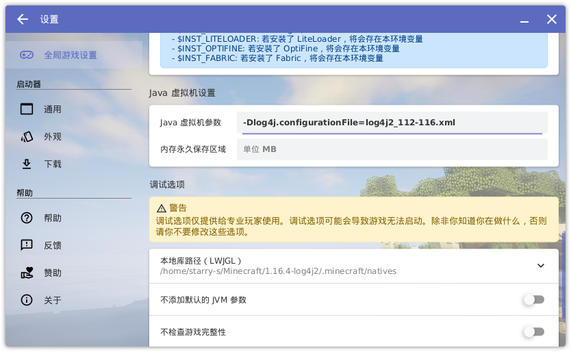

11号中午(CST)，咱收到了Cloudflare发来的安全邮件，提醒我Apache Log4j存在严重0 day漏洞，

不过直到第二天咱在B站上看到了有Up主直播Minecraft的过程中电脑变矿机了，我才意识到事情的严重性。

还好咱的Minecraft服务器玩的人比较少，停服升级Fabric并下载了Minecraft官方提供的有关log4j的配置文件，
还好没有受到影响。

所以咱把配置方法整理一下写在这里帮助一下有需要的人。

<!--more-->

> 这篇文章我之前写在笔记本上，发布的时候忘记把markdown文件`git add`了，后来用台式机写博客时也忘了我写过这个文章这件事。
写年终总结时也总觉得我博客上面好像少了点什么但愣是没想起来我把一篇文章弄丢了这么重要的事。
后来咱翻笔记本时突然发现还有一篇文章忘记了上传，于是赶紧恢复了回来。

-----

## 升级第三方启动器(HMCL)

咱写这个文章时HMCL还没发布稳定版的更新，所以为了修复这个漏洞需要下载[最新的开发版](https://hmcl.huangyuhui.net/download)。

确保你下载的HMCL版本号大于等于`3.4.211`即可。

如果你使用的是其他第三方启动器(比如MultiMC)，记得升级到最新版本。

## 升级Fabric

如果你使用了fabric loader，将fabric loader升级到最新版，官方的安装程序(installer)下载地址为<https://fabricmc.net/use/installer/>

确保你安装的fabric loader版本大于等于`0.12.11`即可。

咱在升级最新的开发版HMCL之后使用官方的fabric installer安装后无法启动游戏，所以如果你使用HMCL启动器的话需要从启动器添加新游戏版本时选择上最新的fabric。

> 升级fabric后如果启动不带fabric的游戏将仍有被攻击的风险，所以如果你只升级了fabric，务必顺带升级一下启动器

## 修改Minecraft的JVM参数

- 游戏版本为1.7-1.16：

  在[Minecraft官网发布的公告](https://www.minecraft.net/en-us/article/important-message--security-vulnerability-java-edition)
  上下载对应你的游戏版本的配置文件`log4j2_XXXX.xml`，把它放到`.minecraft/versions/1.16.4/`目录下（1.16.4为你的游戏版本），之后打开启动器，
  设置JVM启动参数添加`-Dlog4j.configurationFile=log4j2_XXXX.xml`。

  

- 游戏版本1.17：

  在启动器中添加启动参数`-Dlog4j2.formatMsgNoLookups=true`。

- 游戏版本1.18:

  直接升级到1.18.1。

## Others

以上的几种方法都可以修复漏洞，所以比较懒的人只要更新个启动器就好了。

检验漏洞是否被修复的方法是，游戏的聊天中输入`${date:YYYY}`，然后看游戏的日志，如果变成了`2021`(再过几天就是2022了)，则代表漏洞没被修复。
如果游戏日志中显示的也是`${date:YYYY}`，那就基本上没问题了。
