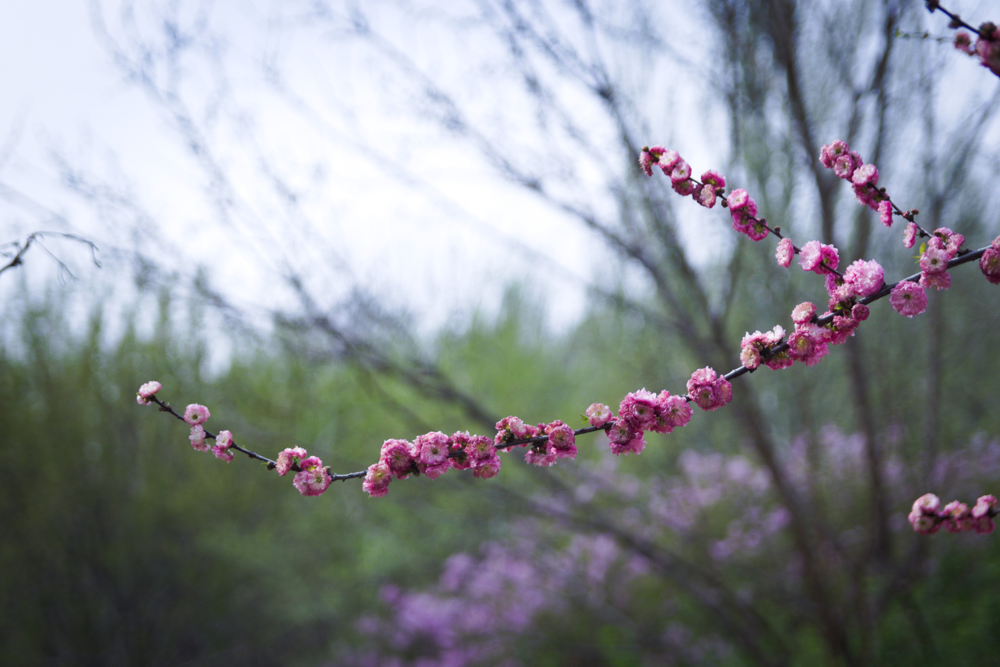
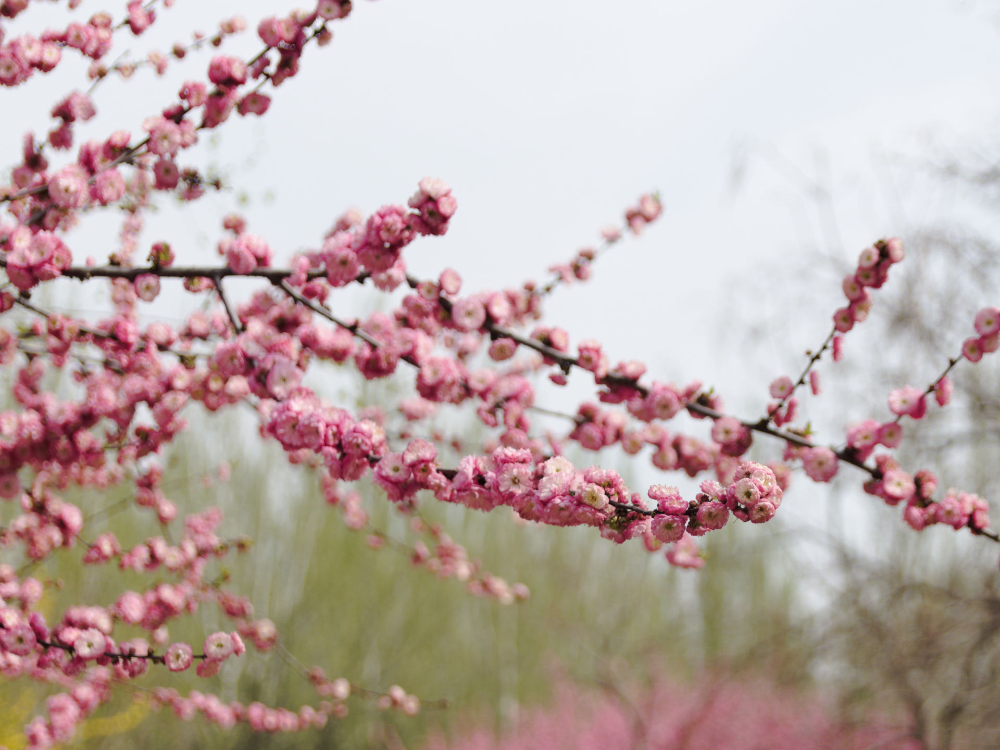
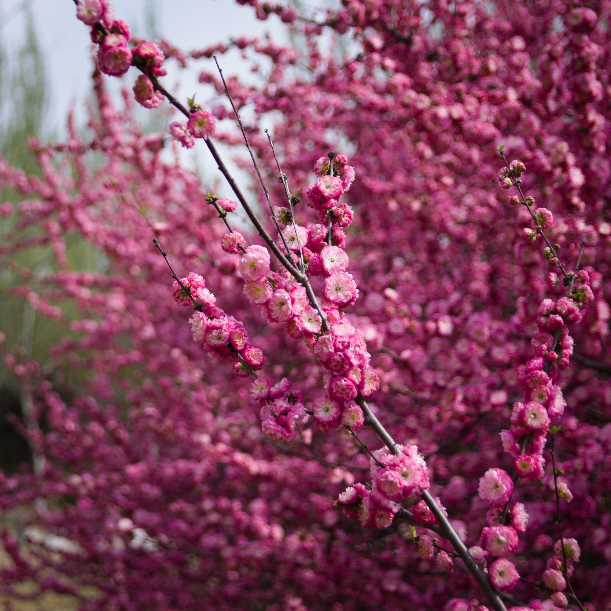
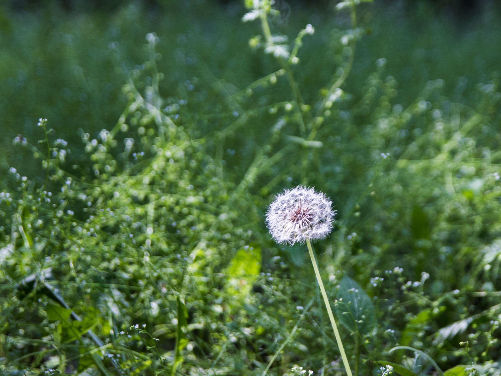
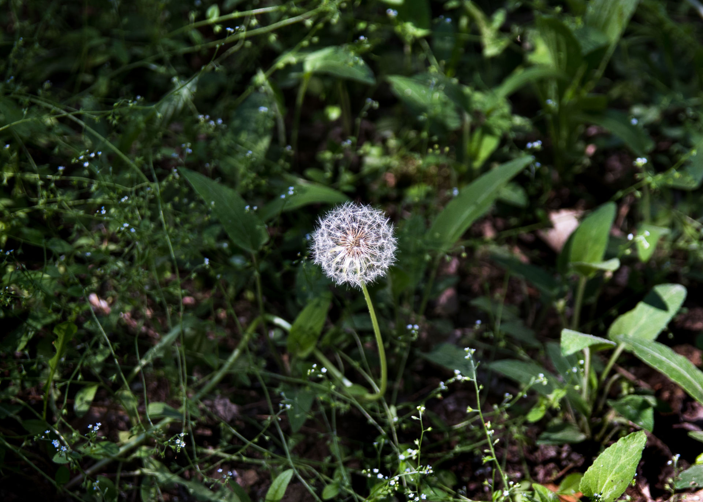
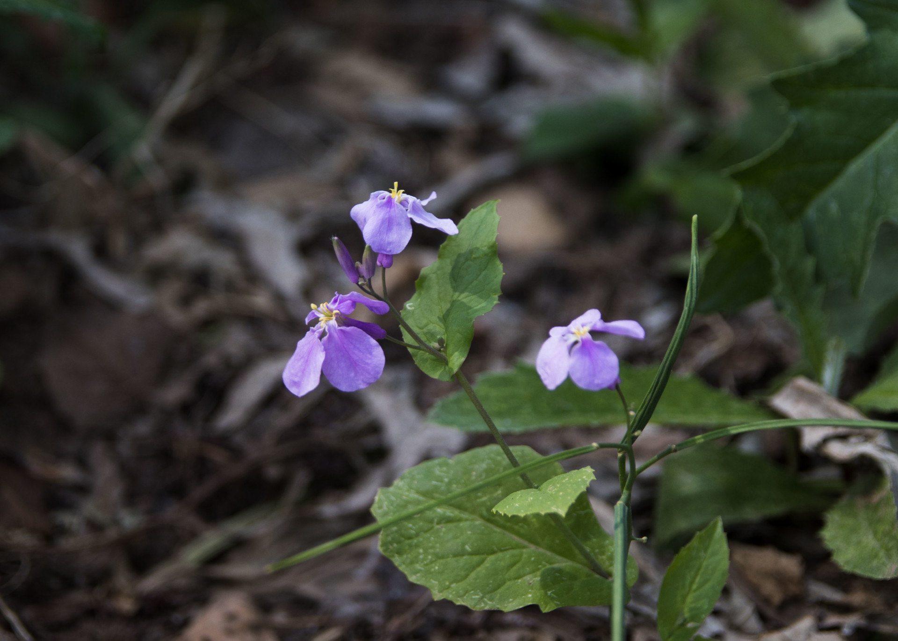

咱去年忘了更新这个系列...

<!--more-->



------

前一阵子买了二手的适马17-50 f2.8镜头，在网上看这镜头很适合新手学摄影，而且这个焦段+大光圈适用的范围也很广。遂把在家吃灰了一年的相机带回学校，打算找时间拍点风景照片。

实际上买完新镜头后我就拿它拍了几张花的照片后也没怎么出过门，本来打算5月初份去长白岛拍樱花的然而经过了五一小长假的调休，上周末的体侧，这周辽宁省又开始闹疫情，所以只好先拍点校内的风景啦。

如果你想看长白岛的樱花，不妨看一下[Spring - 3](/posts/2019/spring-3/)这篇文章。

> 仅使用Raw Therapee和Adobe Lightroom对照片进行了裁剪并调整颜色，并由GIMP压缩

------

> 拍摄自：2021-05-18

在大风天拍蒲公英确实是个不明智的选择。

# Spring - 4
