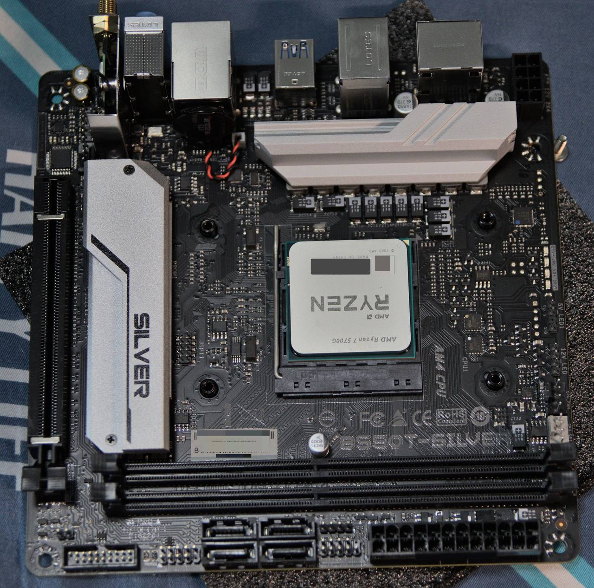
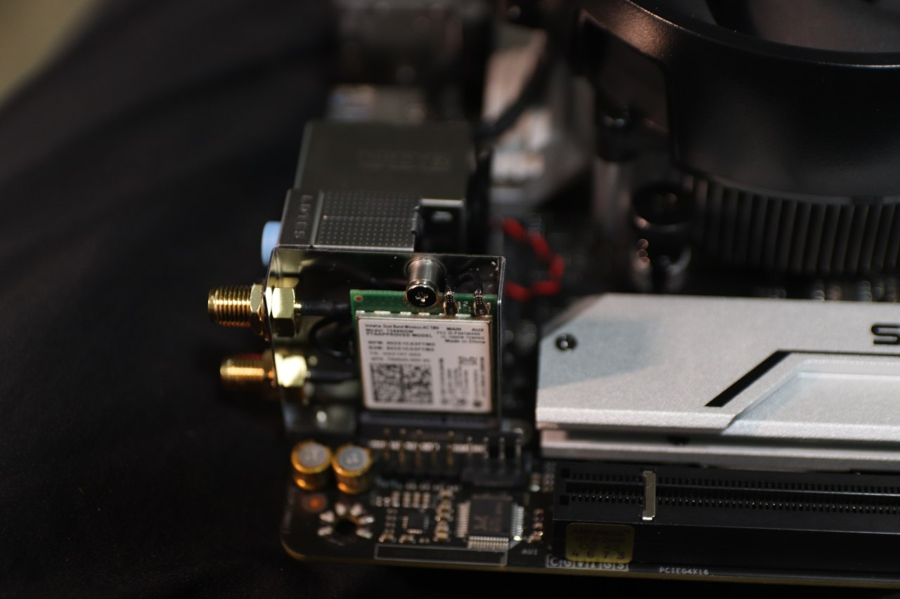
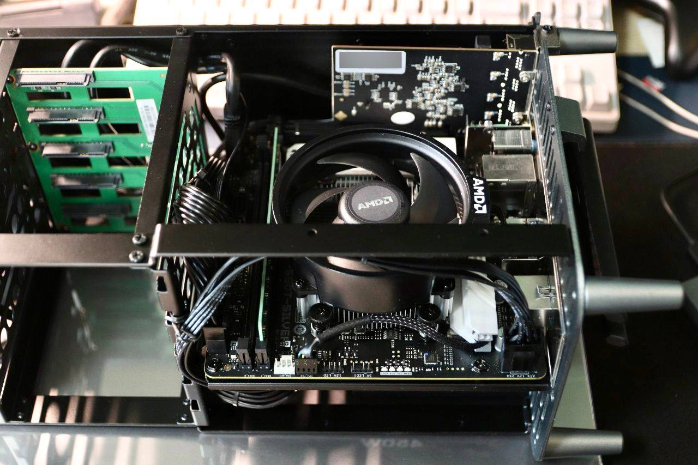
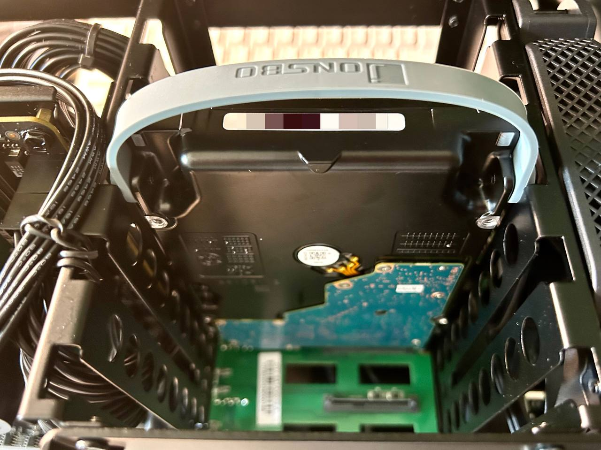

差不多去年的这个时候尝试过用树莓派插移动硬盘的方式试探性的组装了一个 NAS，但实际上用了不到两天这个方案就被废弃掉了……

<!--more-->



## 起因

不用树莓派的原因是，它是 ARM 架构的微型“电脑”，Arch Linux 官方只支持 x86_64 架构的系统，Arch Linux ARM 准确来说实际上是个第三方的系统。
然后树莓派的性能很差，只有一个板载网卡和 2.4G 无线网卡（我手里的是树莓派 3B），所以这玩意实际上更适合做嵌入式什么的，或者给初学者折腾入门 Linux 来用（但是看了眼现在树莓派的售价，我想应该不会有初学者买树莓派入门 Linux 了）。

后来买了 NanoPi R4S 软路由，它内置了一个 RK3399 CPU，虽然也是 ARM 架构但是性能对于软路由来说很够用了，当时也是给它折腾了 Arch Linux ARM 系统还依次尝试了 `systemd-networkd` 和 `netctl` 给它的两个网口配置路由，但折腾归折腾，这种方式并不稳定，在日常使用过程中经常遇到重启路由器后上不去网的情况，还要手动 SSH 到路由器中再重启一次网络服务和防火墙才恢复。虽然手动改网络组件的配置文件的方式配置个路由器更底层些，这个过程也能更好的体会到路由器的一些原理，但是这种方案并不适合长期日常使用，我可不希望动不动家里路由器莫名其妙就断网了还要手动 SSH 到系统里查一堆日志后才能重连网络。

之后我把手里的 R4S 卖掉了，因为 NanoPi 新发布了性价比更高且功耗更低的，拥有俩 2.5G LAN 网口，还有一个 M2 插槽和内置了 8G 闪存的 R5S。我给它安装了更适合路由器使用的基于 OpenWRT 构建的 FriendlyWRT 系统，这个系统内置了 Docker 和一些常用的应用（网络共享、Aria2、硬盘自动休眠之类的），在把光猫改桥接后，用它来做我的主路由器。然后把手里一块空闲的 2T 移动硬盘连接到路由器上，设置了 OpenWRT 的网络共享 (Samba) 服务后，实验性的当作我的 NAS 来使用。

之所以是“实验性”的“NAS”，是因为我不确定 USB 连接移动硬盘的方式是否稳定，因为移动硬盘对供电有一定要求，我并不确定路由器的 USB 接口能否稳定的为硬盘供电，就算连接一块硬盘供电够用的话，我不确定连接两块以上的硬盘组磁盘阵列还能不能带得动，尽管这个问题能通过一根 USB 供电线来解决，但是我那半个巴掌大小的路由器上面既要插三根巨粗无比的 7 类网线，又要插硬盘和 USB 供电线，还要再占用一个插座插一个手机充电器给移动硬盘供电，这也太混乱了点，毕竟机械硬盘在读写过程中很怕震动，我在插拔网线或者插座上其他的电器时都避免不了的会对那块移动硬盘产生震动。

然后路由器毕竟是路由器，你即要它负责整个家庭几十个网络设备的路由功能，又要跑 Samba 服务器，还要往里面装一些“上网插件”的话，对 CPU 的性能还是有一定要求的。因为我的路由器和电脑都有 2.5G 网口，所以我实际测试过当通过 Samba 拷贝文件的速度接近于 200MB/S 时，路由器的 CPU 4个核心就会全跑到 100%，然后拷贝就卡住了，时间久了文件就拷贝失败了（然后我不得不又设置了 QoS 把 2.5G 的网口限速成千兆网口）。

所以最好的办法还是把 NAS 和路由器分开，路由器就用来做路由器该做的事情，NAS 就做 NAS 该做的事情。

> 以上就是我组装 NAS 的整个心路历程，如果觉得上面这一大堆太磨叽的话，直接看下面就好了。

----

## 配置清单

- 机箱：乔思伯 N1
- 主板：映泰 B550T-SILVER ITX
- CPU：AMD R7 5700G
- 内存：英睿达 8G 2666
- 固态：闪迪 500G NVME
- 硬盘：东芝 MG08ACA16TE * 1
- 电源：Tt SFX钢影 450W
- 其他：乐扩 4 口 2.5G PCIE 网卡

系统盘是之前折腾软路由时剩下的一块 500G 的 NVME 固态，除此之外双十一的时候还买了一块东芝的 16T 企业盘。

----

本来想把除硬盘外的整体预算控制在 2K 以内的，但实际上光主板 + CPU 就两千多了……

在深水宝上有更便宜的 5600G + B450 ITX 套装，但是这种来路不明的主板和散片 CPU 尽管便宜了几百块钱但是我也不知道它的 CPU 有没有“锻炼”过，主板有没有换过啥零件，反正我是不敢买。所以挑了好久，决定提高了预算，在狗东买的全新的板 U 套装，选的这个带板载 2.5G 网卡的主板，毕竟我可不想贪小便宜吃大亏。

散热器目前用的是 AMD 盒装 CPU 带的散热，听说这个散热器在拆的时候极有可能会把 CPU 连根拔起，但是我有一个闲置的利民的 itx 散热器放在老家了没拿过来，所以现在只好先用原装的过度一下。

本来是没打算买机械硬盘的，想着先用移动硬盘连在 NAS 上先用一阵子的，不过双十一硬盘便宜了好多，信用卡分三期还能再减 50，所以就先买了一块，估计够我用很长时间的了。

## 装机



映泰的这块板子是不带无线网卡的，但送了一个 WIFI5 的无线网卡，需要手动安装上去，当时废了九牛二虎之力才接上了这两根 SMA 线……。







然后走线的过程其实还挺顺利的，插上主板 24PIN、CPU 8PIN 和 SATA 供电以及风扇、机箱前面板跳线和 USB、音频线之外就完事了，找一些空隙把这些线绑起来就好了，说实话走线的过程可比之前给先马趣造装机容易多了，毕竟少了两根显卡供电线和一堆风扇的电源线还有 RGB 灯的线……

## 装系统

NAS 的系统我采用的是 Arch Linux。首先，选一个 NAS 的系统肯定要优先考虑更适合做服务器的 Linux，其次 FreeNAS 这个系统是基于 FreeBSD/Unix 的，我就是单纯的不想用 BSD 所以就把它排除在方案外了（但是 NAS 里装一个虚拟机跑 FreeNAS 也不是不可以），至于网上总能听到的黑群晖我对这种盗版 + 闭源的系统很反感，所以想都不要想了。提到 Linux 的服务器发行版肯定有人更偏向于 Debian 以及 Debian 衍生的服务器系统以及红帽系列的被经常用在服务器的那些企业常用 Linux 系统，但是我只想用我熟悉的 Arch Linux。Arch Linux 的 Wiki 中有介绍过，Arch Linux 的思维是这个系统并不针对某类应用场景，而是让 Arch 的用户自己配置自己的系统来应用在哪些场景，所以理论上是可以把 Arch Linux 配置成一个适合应用在服务器上的系统，实际上也有 `vps2arch` 这个“黑魔法”脚本可以一键把 VPS 上已安装的其他 Linux 系统转成 Arch Linux。如果在这里你非要和我较真哪个 Linux 发行版好，哪个 Linux 发行版不好的话，我觉得这并不属于一个技术范围该讨论的问题而是一个哲学问题。

安装教程在 Wiki 上就能找到，这里不再赘述，安装系统时需要装一些网络相关的软件，我配置网络使用的是 `netctl`，因为觉得 `systemd-networkd` 不怎么好用，我对 NetworkManager 不怎么熟悉所以就没装这个。然后配置无线连接时还需要用到 `wpa_supplicant`。

### 配置网络

我的 NAS 上面一共有 5 个网口，其中一个网口为板载的 2.5G 网口，另外四个网口为 2.5G 的 PCIE 网口，我当初买这个 PCIE 网卡的时候想的是给它配置个桥接当交换机来用，这样只买一块网卡肯定比买个 4 口交换机便宜，因此装系统后配置网络这部分是重头戏，Arch Linux Wiki 上对配置桥接这部分只是简单介绍了几句就完事了，所以这部分我足足花了两个晚上才全部搞定。

首先创建 `netctl` 的配置文件 `/etc/netctl/bridge-br0` (文件名可以随意修改)，新创建一个虚拟的桥接接口 `br0`，这个虚拟的桥接网口绑定了上述的5个网口。我打算将板载的网口 (`enp9s0`) 连接路由器，然后那 4 个 PCIE 网卡的接口 (`enp3s0` - `enp6s0`) 用来连接其他网络设备，所以要将 `br0` 的 MAC 地址设定为 `enp9s0` 的 MAC 地址。

```console
$ cat /etc/netctl/bridge-br0
Description="Example Bridge connection"
Interface=br0       # 接口的名称
Connection=bridge   # 桥接模式
BindsToInterfaces=(enp9s0 enp6s0 enp5s0 enp4s0 enp3s0)  # 将 br0 绑到 5 个物理网口上
MACAddress=enp9s0   # 设定 br0 的 MAC 地址与 enp9s0 接口的 MAC 地址一致
IP=dhcp             # 以 DHCP 的方式为 br0 获取 IP 地址
```

除此之外还要配置 `enp9s0` 接口的配置文件 `/etc/netctl/noip-enp9s0`，**不要让这个接口自动获取 IP 地址**。

```console
$ cat /etc/netctl/noip-enp9s0
Description='Example configuration'
Interface=enp9s0
Connection=ethernet
IP=no
```

之后执行以下命令使以上两个配置文件生效。

```console
# netctl enable bridge-br0
# netctl start bridge-br0

# netctl enable noip-enp9s0
# netctl start noip-enp9s0
```

顺利的话，执行 `ip addr` 可以看到新增加了一个 `br0` 网口 （不顺利的话就重启一下，再检查一下除了 `netctl` 之外是不是有别的配置网络的应用产生了干扰），然后原有的 5 个网口都绑定到了 `br0` 接口上了（接口的那一行出现了 `br0`）。

然后 `enp9s0` 接口正常来讲是不应该从路由器上获取到 IP 地址的了，取而代之的是 `br0` 接口从路由器的 DHCP 服务器中获取了一个 IP 地址，然后 `br0` 接口的 MAC 地址和 `enp9s0` 接口的 MAC 地址都一致才对。

以下是一个简单的栗子，在不考虑 IPv6 的情况 `ip a` 的输出是类似酱紫的：

```console
$ ip addr
1: enp3s0: <NO-CARRIER,BROADCAST,MULTICAST,PROMISC,UP> mtu 1500 qdisc fq_codel master br0 state DOWN group default qlen 1000
    link/ether ab:cd:ef:xx:xx:xx brd ff:ff:ff:ff:ff:ff
2: enp4s0: <NO-CARRIER,BROADCAST,MULTICAST,PROMISC,UP> mtu 1500 qdisc fq_codel master br0 state DOWN group default qlen 1000
    link/ether ab:cd:ef:xx:xx:xx brd ff:ff:ff:ff:ff:ff
    这里 enp3s0 - enp6s0 这四个接口的情况基本一致所以在此省略
    ......
5: enp9s0: <BROADCAST,MULTICAST,PROMISC,UP,LOWER_UP> mtu 1500 qdisc fq_codel master br0 state UP group default qlen 1000
    link/ether f4:bb:22:xx:xx:xx brd ff:ff:ff:ff:ff:ff
    ......
6: br0: <BROADCAST,MULTICAST,UP,LOWER_UP> mtu 1500 qdisc noqueue state UP group default qlen 1000
    link/ether f4:bb:22:xx:xx:xx brd ff:ff:ff:ff:ff:ff
    inet 10.10.10.233/24 brd 10.10.10.255 scope global dynamic noprefixroute br0
       valid_lft 1606601sec preferred_lft 1375801sec
    ......
```

至此，NAS 是可以与路由器下的同一局域网内的其他设备互相访问的，然后检查下 `/etc/resolv.conf` 如果 DNS 配置正确了的话，也是可以访问到公网的，执行 `curl baidu.com` 是应该有返回的内容的。

但是我们目前只配置了 NAS 自身的板载网口 (`enp9s0`) 与 `br0` 虚拟网口的桥接这部分，现在其他设备通过网线插到 PCIE 网卡的那4个接口是上不去网的。

在计网课程中，老师曾反复强调路由器和交换机的区别，路由器是 OSI 七层模型中的网络层的设备，而交换机是第二层的数据链路层的设备，但光是这么讲的话，死记硬背是能记住这两个设备之间的区别，但这种知识实在过于抽象，很难真正的理解，况且这个“网络模型”是按照已有的网络设备给它拆分成不同的层的，而并不是先制定出了分层的标准然后让设备严格按照这个模型去制作的，所以现在市面上卖的网络设备并没有体现出所谓的分层，不同的网络层之间的界限实际上是很模糊的。在网上搜这方面资料的时候看到有人把路由器称作“3 层交换机”，而常说的那种交换机则称为“2 层交换机”。说实话我也没彻底的搞明白数据链路层和网络层以及路由器和交换机之间的具体区别，不过往简单了说，可以把路由器看成是一个根据 IP 地址在不同的网段之间分发数据的设备，而交换机是通过 MAC 地址，只在一个网段内分发数据的设备，市面上常见的售卖的“路由器”商品实际上是一个真正意义上的路由器 + 交换机 + DHCP服务器和其他组件的组合体，知道这些基本就够用了，再往详细了讲的话我也讲不明白了。

然后修改 PCIE 网卡的 4 个接口 `enp3s0` - `enp6s0` 的 MAC 地址和板载网口 `enp9s0` 的 MAC 地址一致，这样5个网口和虚拟的 `br0` 网口都使用同一个 MAC 地址，就能实现交换机的功能了，至于为啥要把 5 个网口的 MAC 地址都设置一致这个别问我，我也不到为啥，如果这里有哪些知识点有误，可以评论告诉我。

因为 `netctl` 好像不支持修改接口 MAC 地址的操作，所以这里还是要用到 `systemd-networkd` 在开机时自动修改网口的 MAC 地址，在 `/etc/systemd/network/` 中创建 `00-enp3s0.link` - `00-enp6s0.link` 这 4 个配置文件。

```conf
# cat /etc/systemd/network/00-enp3s0.link
[Match]
# 这个是网口原有的 MAC 地址
MACAddress=aa:bb:cc:dd:xx:xx

[Link]
# 这个是修改后的 MAC 地址
MACAddress=f4:bb:22:xx:xx:xx
NamePolicy=kernel database onboard slot path
```

确保 `/etc/systemd/network/` 中没有其他的配置文件后，`systemctl enable --now systemd-networkd` 启动 `systemd-networkd`，在重启电脑后 5 个接口的 MAC 地址就都一致了。

至此交换机这部分就配置完了。

### 配置 Samba

目前我还没有机械硬盘，只有一个移动硬盘通过 USB 连接到了 NAS 上，目前我使用的是 `hd-idle` 配置了硬盘的自动启停。

```console
$ sudo hd-idle -a /dev/sda -i 300
```

然后安装 `samba`，在 `/etc/samba/` 目录下创建 `smb.conf`，具体的过程请参照 [Wiki](https://wiki.archlinux.org/title/Samba)。

我把我的 16T 硬盘格式化成 `btrfs` 后挂载到了 `/samba/hdd_16t_1` 目录下面，然后对应的 Samba 配置文件为：

```conf
[HDD16T1]
  force user = root
  comment = HDD 16T 1
  path = /samba/hdd_16T_1
  valid users = samba
  public = no
  writable = yes
  browsable = yes
  printable = no
  create mask = 0644
  directory mask = 0755
  read only = no
```

我打算只在内网访问我的 NAS，我还不打算把它暴露到公网上，所以目前不用太考虑安全的问题。

然后我目前不考虑组 RAID，首先是因为没钱再买硬盘了，其次是 RAID 并不适合作为冗余备份使用，它没办法保证数据的绝对安全，所以如果我要存重要的数据的话，还是要往别的移动硬盘里也拷贝一份的，所以目前来看 RAID 我暂时用不上。

东芝这块盘收货之后，我用 Samba 往里面烤了俩小时文件没遇到失败的情况，速度一直维持在 100MB/s 以上很稳定，至于噪音的话，白天是感觉不出来 NAS 的声音的，晚上因为配置了硬盘自动停转所以只要睡觉时不用它下载东西的话也是听不到声音的。

## 其他

之所以买了 8 核 16 线程的 CPU 是因为我除了让它做 Samba 服务器之外还打算在上面跑一些别的服务啥的，目前除了 Samba 之外我在上面跑了 qemu KVM 虚拟机，然后在局域网搞了 Kubernetes 集群，因为公有云价格太贵了我自己租不起长时间的高性能 VPS，所以在本地起几个虚拟机装轻量级的集群用来学习 k8s 还是可以轻松实现的，不过我目前还没想好可以在集群里跑些什么东西。

后续我打算把我的 MineCraft 单机生存的存档也放到 NAS 上面当服务器跑，这样就可以实现一些只有在服务器才能实现的操作了（比如挂个假人 24 小时挂机刷怪之类的）。

以后有时间的话再写个 TeleBot 机器人啥的，用来远程监控 NAS 的状态。

----

**STARRY-S**
