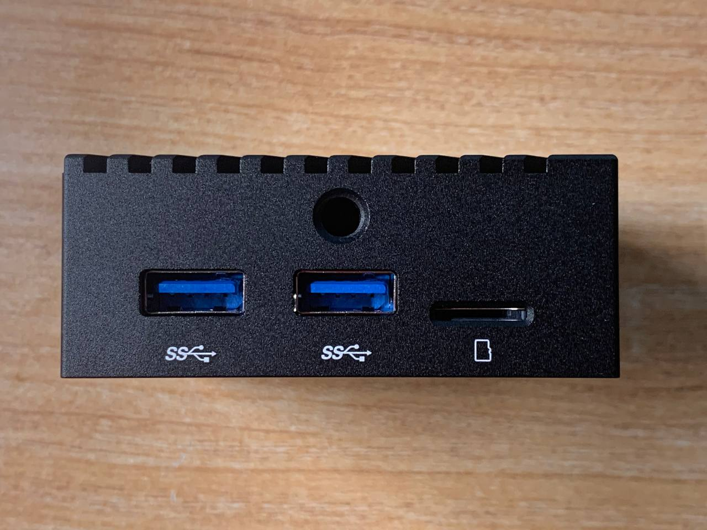
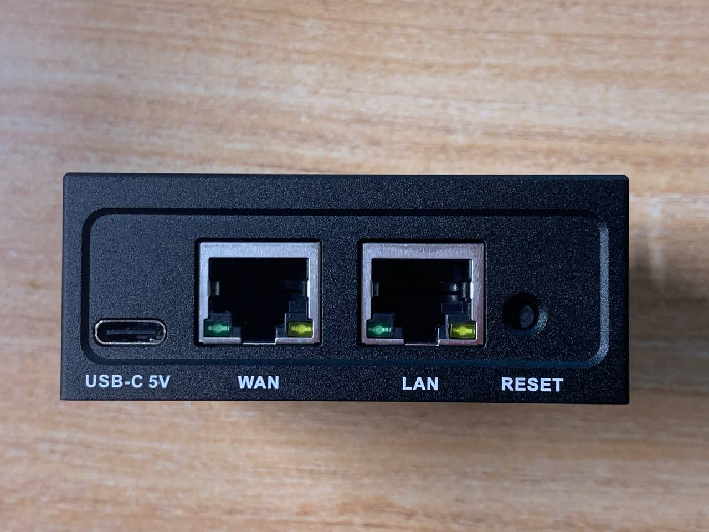
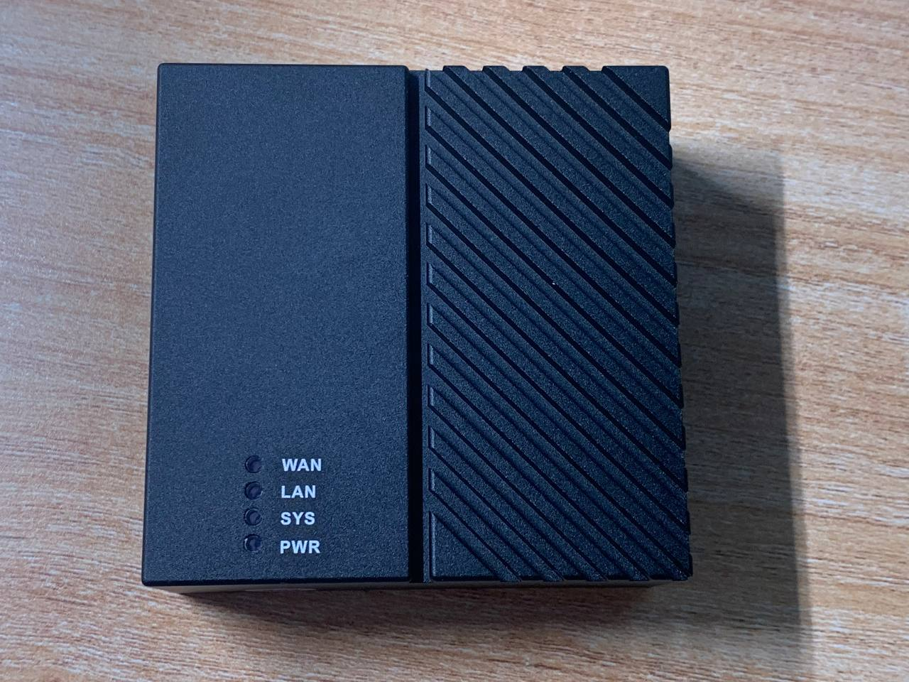
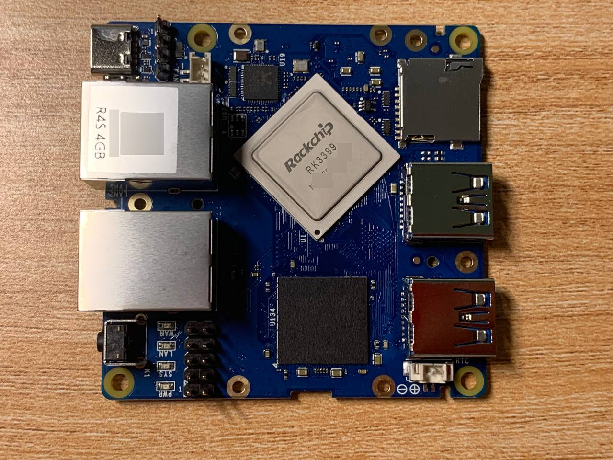
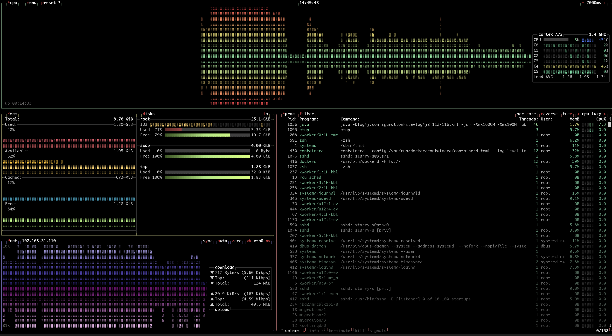
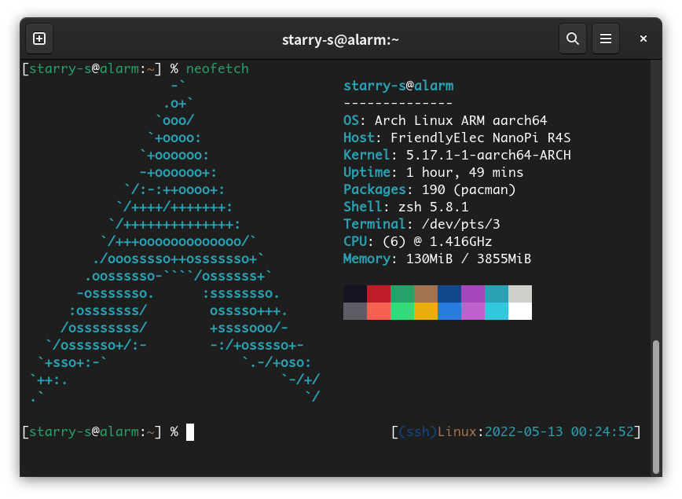

前两天下单了个Nano Pi R4S，4G内存的版本。通常情况下这玩意别人都把他当软路由用，但是今天咱收到货后想了一会拍大腿一寻思这玩意不就是个ARM架构的小电脑嘛~

所以咱暂时先不打算给这玩意装OpenWRT或 *WRT这类的路由器系统了，而是把它当成一个超小号的带俩网口的mini主机折腾。

<!--more-->



## 开箱







## 拆解

咱收到货后第一件事就是找螺丝刀和塑料卡片把这漏油器拆开看看（



芯片的布局可以在[R4S的商品页面](https://www.friendlyelec.com/index.php?route=product/product&product_id=284)查到，[官方Wiki](https://wiki.friendlyelec.com/wiki/index.php/NanoPi_R4S)上也有更多关于R4S的介绍。

## Arch Linux ARM

在Arch Linux ARM (简称alarm) 官网上没找到对R4S的官方的支持，简单搜了一下armbian有对R4S的官方支持。

因为用惯了**滚动更新**发行版，所以不想用\*bian系统，而\*WRT系统的软件包相对其他发行版而言更少一些，系统也相当于被魔改过，所以除了做漏油器之外几乎干不了别的，所以这是我想安装Arch Linux的理由。

然后咱搜到了一篇给[NanoPi R2S安装alarm的教程](https://gist.github.com/larsch/a8f13faa2163984bb945d02efb897e6d)，评论里有人提到了给R4S安装也是可以的。

所以咱大致把这个教程翻译一下，再修改一些R2S和R4S在安装时的区别。

以下内容需结合alarm的 [aarch64通用安装教程](https://archlinuxarm.org/platforms/armv8/generic)食用，像更新pacman-key，ssh的密码之类的部分咱就不在这里重复了。

### 准备SD卡

0. 下载armbian的镜像，下载链接自行谷歌。

    > 通常下载好的文件是`xz`格式的压缩文件，需要使用`unxz`解压成`img`镜像。

1. 将armbian镜像的`bootloader`和`uboot`(32-32767区块的部分)用`dd`写到SD卡中：

    ```
    # Clean the sector before 32
    dd if=/dev/zero of=/dev/sdX bs=1M count=32

    # Write uBoot and bootloader
    dd if=Armbian_*.img of=/dev/sdX skip=31 seek=31 bs=512 count=32736
    ```

    > 其实可以直接用`dd`把armbian的整个镜像写到内存卡中然后插入R4S开机，第一次开机后他会自动重新给内存卡分区，然后只需把`/dev/sdX1`格式化成ext4就能安装alarm了。

2. 使用`fdisk`给内存卡分区并格式化文件系统

    创建分区时先按`o`创建个MBR分区表，然后按`n`添加分区。第一个分区的起始区块(sector)需要设置为32768，通常情况下分一个区就够用了，或者你可以像我这样分俩区，一个给swap，不过实际没啥必要。

    ```
    Disk /dev/mmcblk1: 29.72 GiB, 31914983424 bytes, 62333952 sectors
    Units: sectors of 1 * 512 = 512 bytes
    Sector size (logical/physical): 512 bytes / 512 bytes
    I/O size (minimum/optimal): 512 bytes / 512 bytes
    Disklabel type: dos
    Disk identifier: 0x33fc535e

    Device         Boot    Start      End  Sectors  Size Id Type
    /dev/mmcblk1p1         32768 53944319 53911552 25.7G 83 Linux
    /dev/mmcblk1p2      53944320 62333951  8389632    4G 82 Linux swap / Solaris
    ```

    创建完分区后，把`root`分区`mkfs.ext4`格式化成ext4，swap分区用`mkswap`格式化。

3. 解压alarm系统文件到root分区中
4. 复制并替换armbian的`/boot`中的文件到新建分区的`/boot`文件夹中。
5. 编辑`/boot/armbianEnv.txt`，更新`rootdev`的UUID
    使用`blkid`或者`lsblk -o+UUID`可以查看UUID，注意是**UUID**不是PARTUUID。
6. 插电，开机 (~~此处不会出现五安大电牛~~)，网线连接R4S的WAN口到路由器的LAN口，第一次开机需要生成SSH Key所以时间会久一些，然后就可以ssh到R4S上去辣。

### 内核

上述的安装步骤使用的armbian的内核，可以正常开机，但是想用Arch Linux stock aarch64内核的话，得替换一下DTB文件。（DTB文件是啥我目前还不清楚，如果后续弄明白了再更新到博客上吧）

1. ssh到R4S中，安装`linux-aarch64`。
2. 修改使用的DTB文件：
    ```
    cd /boot
    rm dtb
    ln -sf dtbs dtb
    ```
    编辑`armbianEnv.txt`，在末尾添加一行`fdtfile=rockchip/rk3399-rockpro64.dtb`。

    > 在`/boot/dtb/rockchip`目录下是可以找到`rk3399-nanopi-r4s.dtb`文件的，但是目前用这个DTB的话会导致PCIE不能正常工作，导致LAN口无法使用。
    > `dmesg`的输出为：

    > ```prolog
    > dmesg | grep pci
    > [    0.538310] ehci-pci: EHCI PCI platform driver
    > [    0.559708] ohci-pci: OHCI PCI platform driver
    > [    2.999933] rockchip-pcie f8000000.pcie: host bridge /pcie@f8000000 ranges:
    > [    2.999974] rockchip-pcie f8000000.pcie:      MEM 0x00fa000000..0x00fbdfffff -> 0x00fa000000
    > [    2.999987] rockchip-pcie f8000000.pcie:       IO 0x00fbe00000..0x00fbefffff -> 0x00fbe00000
    > [    3.000410] rockchip-pcie f8000000.pcie: no vpcie12v regulator found
    > [    3.500881] rockchip-pcie f8000000.pcie: PCIe link training gen1 timeout!
    > [    3.500944] rockchip-pcie: probe of f8000000.pcie failed with error -110
    > ```
    > 于是就先用rockpro64的DTB文件了。

3. 创建uBoot镜像和initramfs。
    ```bash
    pacman -S uboot-tools
    mkimage -A arm64 -T ramdisk -n uInitrd -d /boot/initramfs-linux.img /boot/uInitrd-initramfs-linux.img
    ln -sf /boot/uInitrd-initramfs-linux.img /boot/uInitrd
    ```

    创建个`pacman`的钩子，在以后更新`linux-aarch64`的时候自动的重新构建uboot和initramfs。

    在`mkdir -p /etc/pacman.d/hooks`目录下创建`/etc/pacman.d/hooks/initramfs.hook`
    ```pacmanconf
    [Trigger]
    Operation = Install
    Operation = Upgrade
    Type = Package
    Target = linux-aarch64

    [Action]
    Description = Generate uInitrd
    Exec = /usr/bin/mkimage -A arm64 -T ramdisk -n uInitrd -d /boot/initramfs-linux.img /boot/uInitrd-initramfs-linux.img
    When = PostTransaction
    Depends = uboot-tools
    ```
4. 重启，`uname -a`输出的应该是新版本的内核了。

    有个细节，用armbian的DTB文件时，开机后SYS LED灯是闪烁的，但是换到rockpro60的DTB文件后只有PWR灯长亮，别的灯都不闪了。

## Router

虽然装的是Arch Linux ARM系统，但是这并不代表它不能作为一个路由器使用。

系统默认用的是`systemd-networkd`管理网络，所以以下内容使用`systemd-networkd`配置路由器，暂时没遇到问题，如果不行的话我再换别的。

> 参考: [Router - ArchWiki](https://wiki.archlinux.org/title/Router)

### 重命名网络接口

> 这一步并非必须，但是我有遇到重启系统后网口从`eth0`变成`eth1`的情况，所以还是给网口重命个名好一些。

首先移除并备份`/etc/systemd/network`中原有的配置文件。

```bash
cd /etc/systemd/network

# backup config files
mv ./* /root/
```

获取WAN口的mac地址。

```bash
cat /sys/class/net/eth0/address
12:34:56:78:90:ab
```

创建`10-extern0.link`，重命名`eth0`到`extern0`。

```pacmanconf
[Match]
MACAddress=12:34:56:78:90:ab

[Link]
Description=WAN
Name=extern0
```

另一个网口(LAN)在开机时`systemd-networkd`会自动给他重命名为`enp1s0`。

### WAN口配置DHCP客户端

这里我是把R4S的WAN口接到另一台路由器的LAN上，所以配置的是DHCP客户端。如果你打算直接把路由器接光猫，而且你的猫设置了桥接，那么你可能需要配置PPPOE。

创建`20-extern0.network`。

```pacmanconf
[Match]
Name=extern0

[Network]
DHCP=yes
```

### LAN口配置静态IP和DHCP服务器

给LAN口设置成另一个网络的静态IP地址，并配置DHCP服务器，给连接到LAN口的机器分配同一个网络下的其他IP地址。

创建`20-enp1s0.network`。

```pacmanconf
[Match]
Name=enp1s0

[Network]
Address=10.0.0.1/24
DHCPServer=true
IPMasquerade=both

[DHCPServer]
PoolOffset=100
PoolSize=100
EmitDNS=yes
# DNS=8.8.8.8
```

我这个配置是给LAN口设置了静态IP地址`10.0.0.1`，掩码`255.255.255.0`，启用了DHCP服务器，
设置了IPv4数据“伪装”(packets forwarded from the network interface will be appear as coming from the local host)。

有关配置文件的参数可以使用`man systemd.network`查询。

暂时还没搞懂怎么折腾IPv6，如果配置好IPv6的话我再补上……

## 后续

之后咱装了JDK以及一堆我常用的小组件。为了测试性能，我把我以前备份的Minecraft服务器复制到R4S上跑了一下试试。我的服务器之前是在疼讯云学生主机上跑的(1核2G)，装了好多性能优化插件(lithium，phosphor，carpet...)，版本是1.16.4，抱着尝试的心态跑了一下这个服务器结果发现很流畅，一开始区块加载的时候CPU的6个核心全跑满，之后就恢复到正常水平了。刚才尝试了一下长时间的生成区块貌似没什么大的问题，只要别一直用鞘翅跑图就行，应该是内存够用了所以运行效果要好一些，不过单核性能来讲的话肯定还是X86吊打R4S的。

毕竟这就是半个巴掌大小的机器，跑MC的时候CPU温度才不到50度，应该不需要主动散热，功耗才十多瓦……





## 参烤链接

- [NanoPi R4S](https://www.friendlyelec.com/index.php?route=product/product&product_id=284)
- [NanoPi R4S - FriendlyELEC WiKi](https://wiki.friendlyelec.com/wiki/index.php/NanoPi_R4S)
- [Installing Arch Linux AArch64 on the NanoPi R2S](https://gist.github.com/larsch/a8f13faa2163984bb945d02efb897e6d)
- [Generic AArch64 Installation | Arch Linux ARM](https://archlinuxarm.org/platforms/armv8/generic)
- [Router - ArchWiki](https://wiki.archlinux.org/title/Router)
- [systemd-networkd - ArchWiki](https://wiki.archlinux.org/title/Systemd-networkd)
- [systemd.network(5) — Arch manual pages](https://man.archlinux.org/man/systemd.network.5)
- [在 NanoPi R2S 上安装 Archlinuxarm - 知乎](https://zhuanlan.zhihu.com/p/392619184)
