北京的春天来得真早……

<!--more-->

----



## 玉渊潭

因为去北京实习的时候没带单反相机，然后实际上我对北京的花并不感兴趣。之所以去玉渊潭是因为博客一个多月没更新了，
正好赶上现在春天我该更新这个系列的博客了，然后在网上总是能看到有人晒北京春游拍的照片，想着既然来都来了，出去溜达溜达也不吃亏，
周末总宅在这不到10平米的出租屋里也不行，于是趁着周末去了一趟玉渊潭，应该是因为疫情的原因，人不是非常多，
我去的时候虽然已经是北京的晚春了，不过玉渊潭的樱花开得正旺。不过说实话用手机拍照片手感比单反相机差太多了，成像的质量也有很大的区别。

所以手机在太阳直射的强光下拍的花要么是红彤彤一片，要么就是白哗哗一片，因为懒加上时间有限，我就不调颜色了，直接把照片贴到了博客上。

照片中的这些花我叫不出名字来，哪些是樱花我也忘了，因为在我眼里这些只是一群花而已，没啥太大区别。

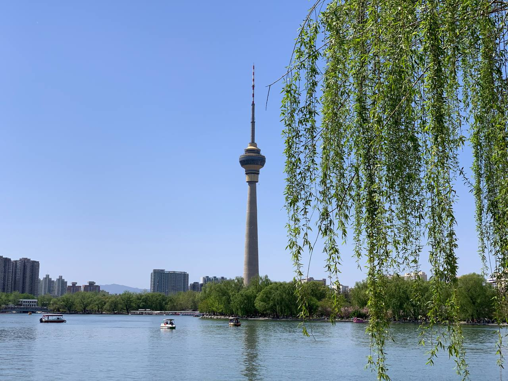

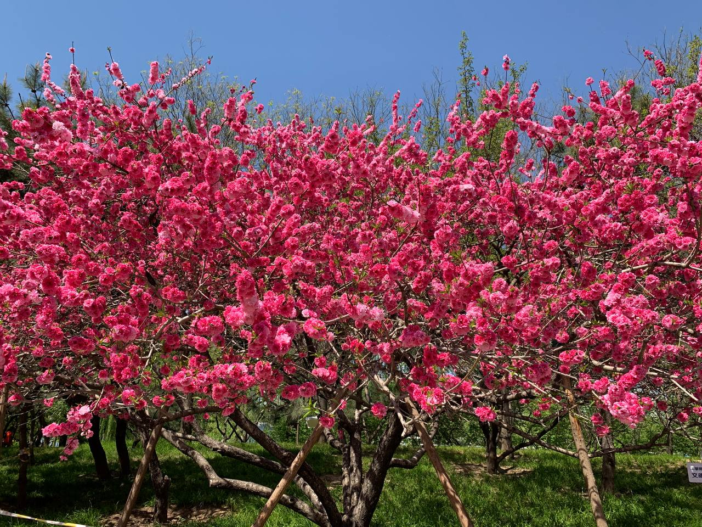

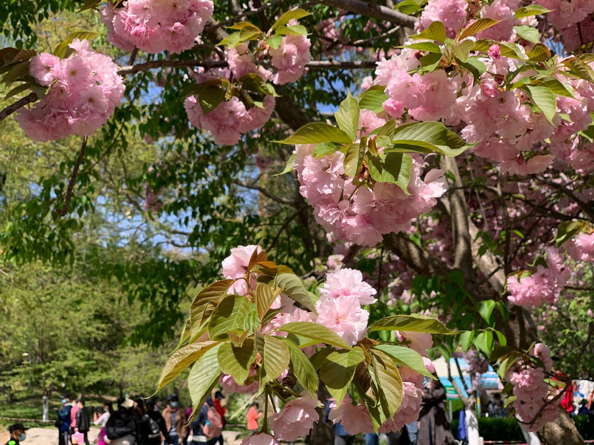

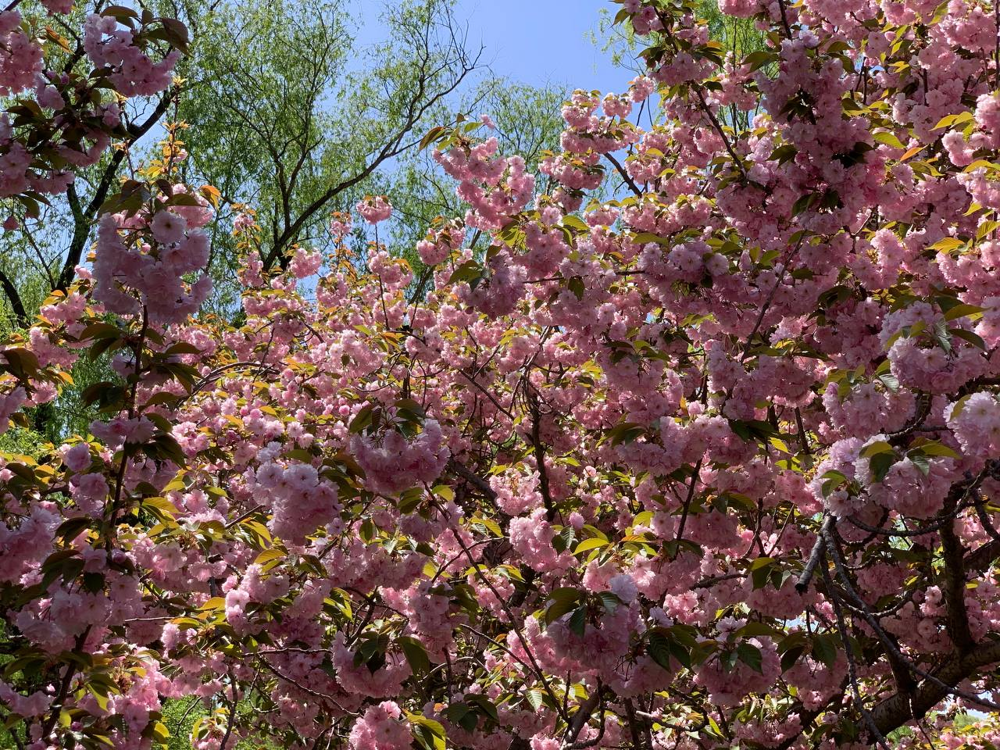

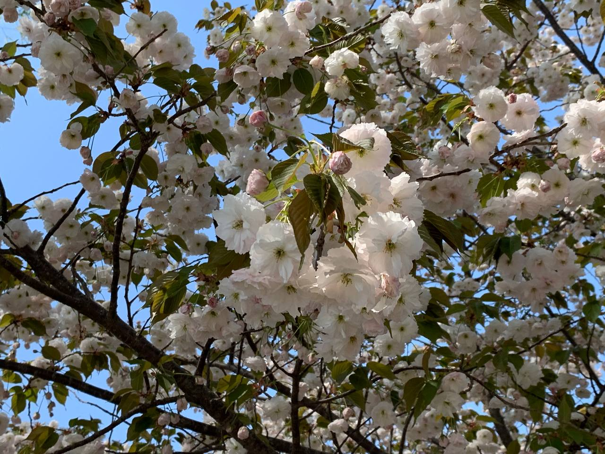

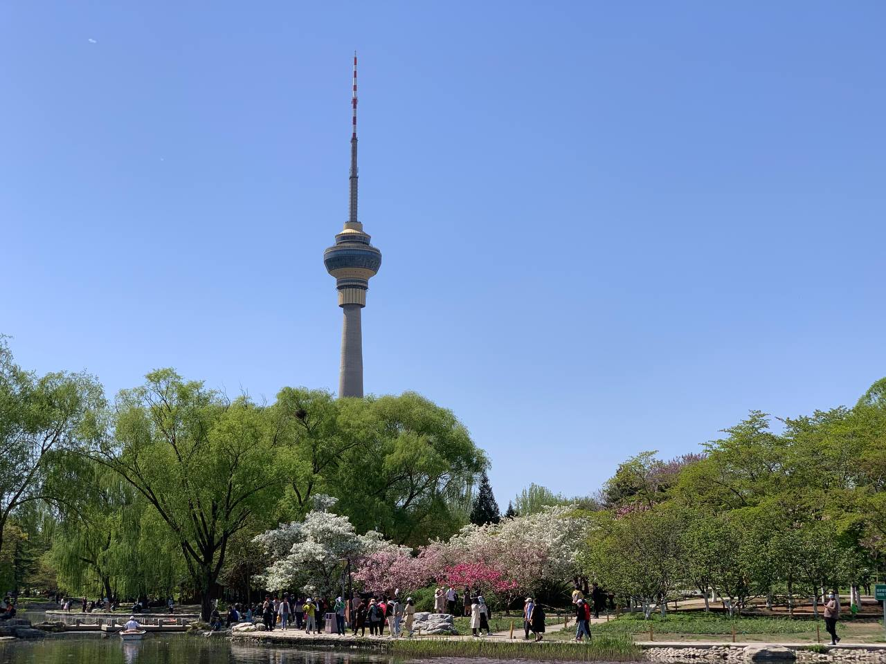

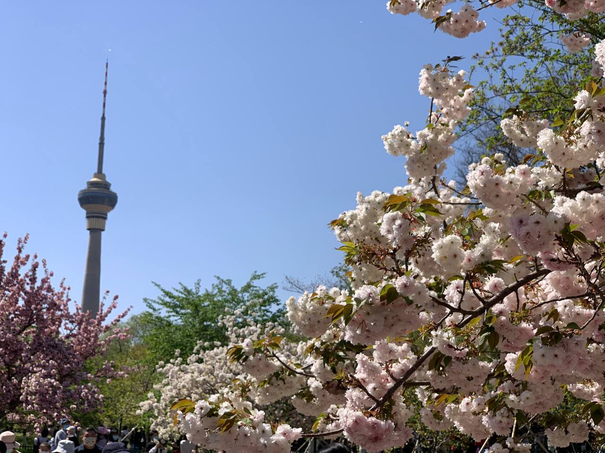

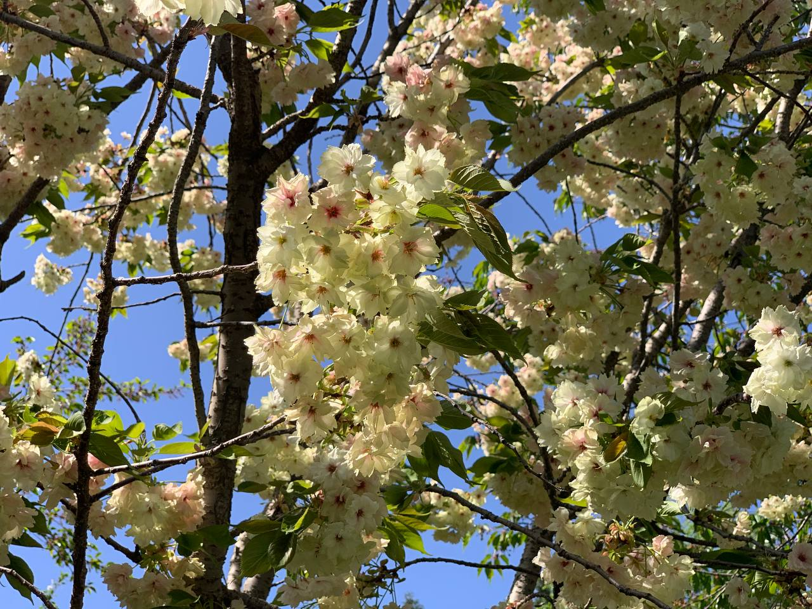

## 三月中旬的暴雪

三月中旬的时候北京白天的气温已经很高了，室外很多桃花都开了，不过来了一场倒春寒在刚停暖气那会儿下了一场暴雪。
一开始还挺羡慕辽宁老家那边下的暴雪，看别人发沈阳的树都盖了一层雪很好看，然后隔了一两天北京也下了这么大的雪。

所以很开心，那天恰巧是在家办公，于是晚上趁天还没黑就跑到小区楼下拍了几张雪景图。

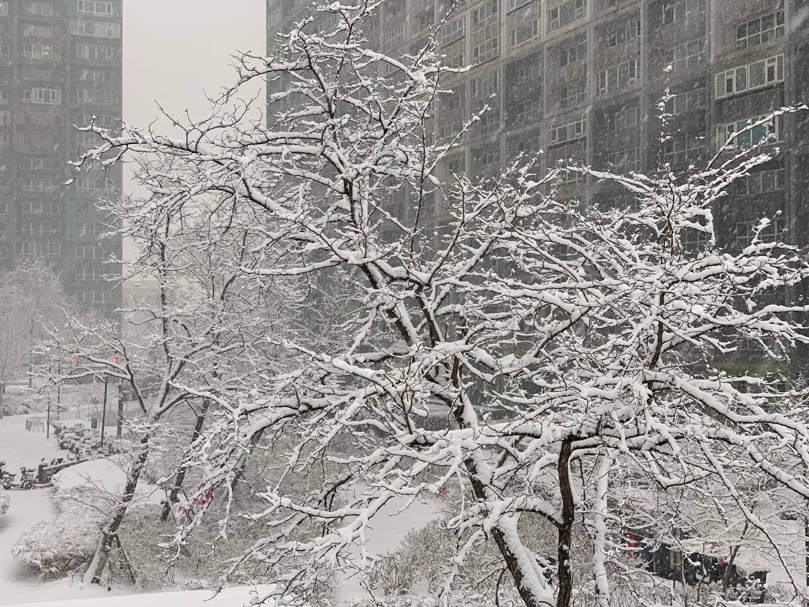

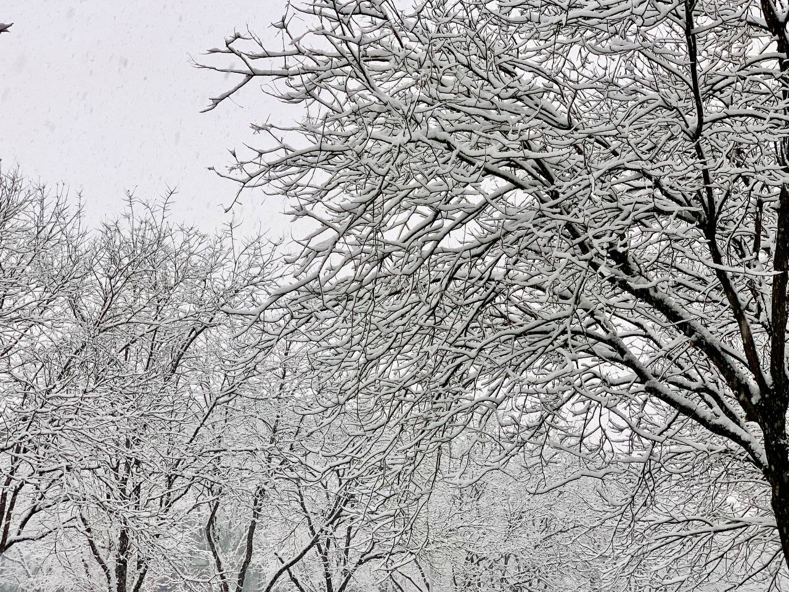

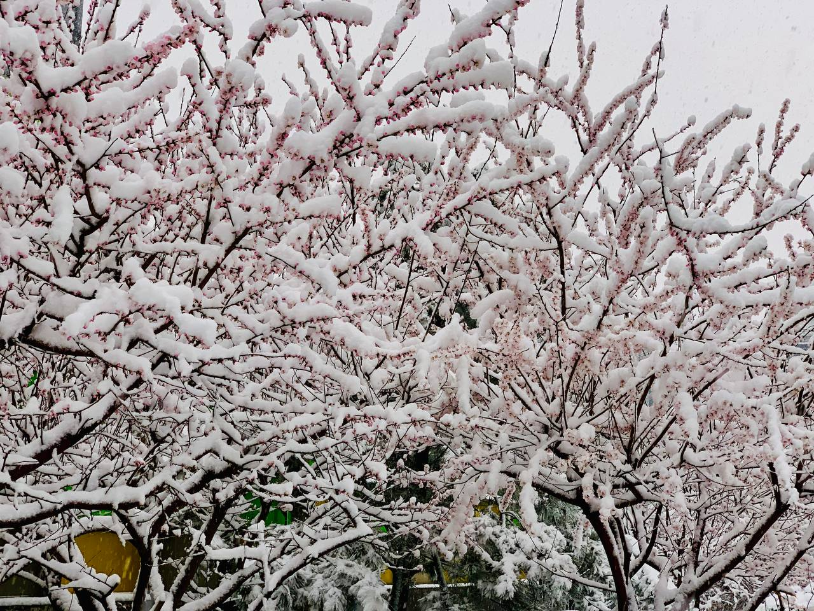

这种在三月中下旬下这么大雪的情况说实话在北京应该蛮少见的吧。

## Others

首先是我给博客换了个新的主题，准确说应该是把博客迁移到了Hugo，主题换成了[LoveIt](https://github.com/dillonzq/LoveIt)。
我当时找Hugo的主题主要的要求就是简洁、暗色模式还有音乐播放器插件。于是看了LoveIt这个主题刚好暂时符合我的需求，就选择了这个主题。

之后在某个周末的下午抽时间把博客迁移到了Hugo上面去，照着Hugo的Wiki搞了个GitHub Action在提交commit时自动部署博客，
然后是因为暂时没什么友情链接，所以我砍掉了友情链接页面，如果有需要的话以后我可能会加上。还有我目前砍掉了搜索的功能，
因为我个人觉得用不上。除此之外把之前用的GitHub Issue评论改成了Disqus，尽管在墙内没办法评论，但是用GitHub Issue总给人感觉这不像是在写评论而是在提问题。
不过这些对我来说影响都不大，毕竟我的博客这么多年了只有我自己的一两条测试评论而已。

----

之后我更新一下在北京实习的情况，SUSE对待实习生真的比预想中的还要好很多，实习的氛围非常好，能到SUSE实习真的非常开心。
公司在英国寄了入职礼包，在拿到绿色变色龙后真的特别开心，算是终于实现了一个期盼多年的心愿吧。

因为是测试岗，实习的这段时间学了些测试相关的知识，学了一点Perl编程语言，工作中大部分测试都要在openQA自动化测试工具上面跑。
个人感觉openQA上手的确有些难度，不过我对使用openQA并不怎么抗拒，尽管它确实挺复杂的，官方的文档目前来说对新人不是很友好。
不过我觉得实际上还好，openQA要是用熟练了的话还是蛮方便的，新Build一发布后它一晚上就自动就把测试跑完了，
不用手动反复的重复那些无聊的机械化测试工作，这一点还是蛮重要的。

不过实习结束后我还是要回沈阳的，尽管北京很多方面比沈阳好很多（沈阳和北京根本没可比性，两个性质截然不同的城市没办法对比），
不过对我来说回沈阳的话能节省很多成本，不用背井离乡到北京漂这一点对我来说还是蛮重要的。
我觉得的没必要挤破脑袋往北上广这种大城市进，人家压根也不欢迎你来。所以这不是个长远的办法，在北京漂几年后总是要回老家的。
在沈阳念了三年多的大学后觉得这城市其实挺好的，不过是网上对沈阳评价不高。

就写这么多，明天还要早起在地铁首发车上抢座。

----

**STARRY-S**