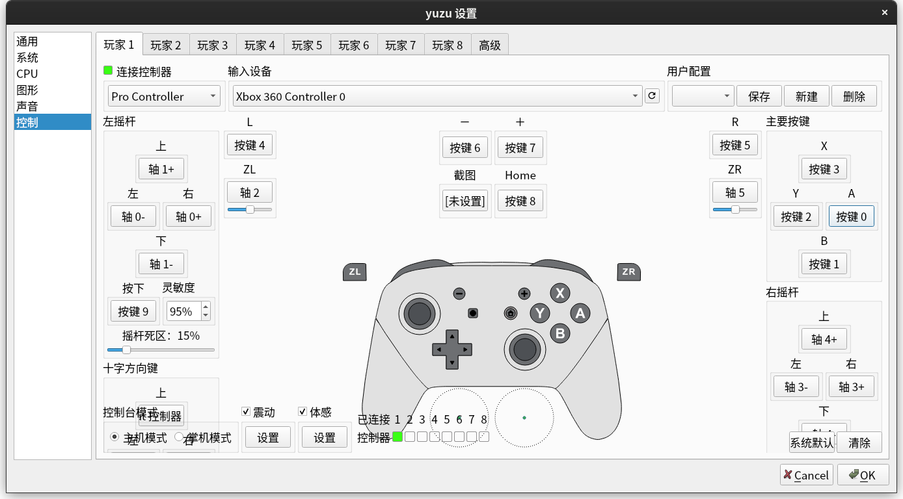

一直想玩的游戏没有官方汉化，Switch 的游戏文件没破解的话是没办法装汉化插件的，尽管咱有 Switch OLED 港版主机，但是破解有被封的可能而且过程过于麻烦，破解后就不能联网了，所以咱在买了正版游戏但是看不懂日语后无奈之下选择了虚拟机，正好水一篇博客。

<!--more-->



目前有两个虚拟机可选，一个是 由 C# 编写的 [Ryujinx](https://github.com/Ryujinx/Ryujinx)，另一个是由 C++ 编写的 [yuzu](https://github.com/yuzu-emu/yuzu)，这俩都是开源软件而且都能在 Linux 上运行，咱选的是后者。

---

yuzu 提供的教程需要短接器和一张TF卡以及 switch 本体，从 switch 中获取 `prod.keys` 和 `title.keys` （非必须），喜欢折腾的可以买个短接器慢慢鼓捣，教程链接：<https://yuzu-emu.org/help/quickstart/>。如果懒得折腾的话从网上找个现成的 key 文件也能用。

Arch Linux 可以从 archlinuxcn 源或者 AUR 中获取。

```sh
sudo pacman -S yuzu-git
```

第一次启动时会提示缺少 keys，可先忽略，选择左上角 `File->Open yuzu Folder`，新建一个 `keys` 文件夹，将 `prod.keys` 复制进去后重启软件。

yuzu 可以在不手动安装系统的情况下运行游戏，所以添加了游戏所在的文件夹就能玩了。


然后就是在设置里面改一下手柄的按键布局，因为用习惯了 Xbox 手柄，所以咱把 A 和 B 位置对调了一下。



---

后续：

Yuzu 2023-05-21 之后的版本对宝可梦做了些优化导致玩月姬时文字花屏乱码，玩月姬的话不要下载 2023-05-21 (1440) 之后的版本。

然后 Arch Linux 最近滚完系统后遇到了 yuzu 的 Qt 启动失败报错：

```
Warning: Ignoring XDG_SESSION_TYPE=wayland on Gnome. Use QT_QPA_PLATFORM=wayland to run on Wayland anyway.
qt.qpa.plugin: Could not find the Qt platform plugin "wayland" in ""
This application failed to start because no Qt platform plugin could be initialized. Reinstalling the application may fix this problem.

Available platform plugins are: xcb.

zsh: IOT instruction (core dumped)  yuzu
```

查了一阵子找到的解决办法是设置 `QT_PLUGIN_PATH=/usr/lib/qt/plugins` 环境变量，覆盖掉 yuzu 安装包自带的 Qt 插件而是改用系统的。
