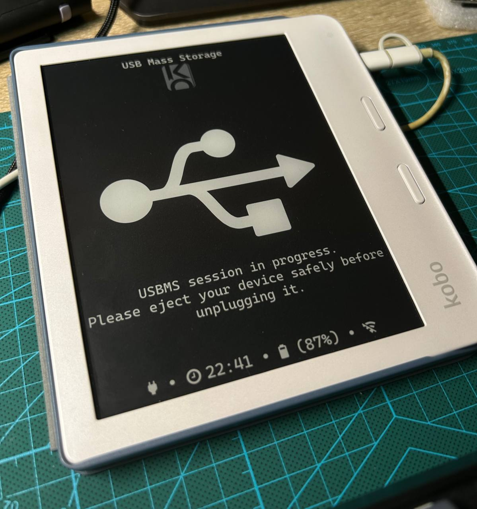
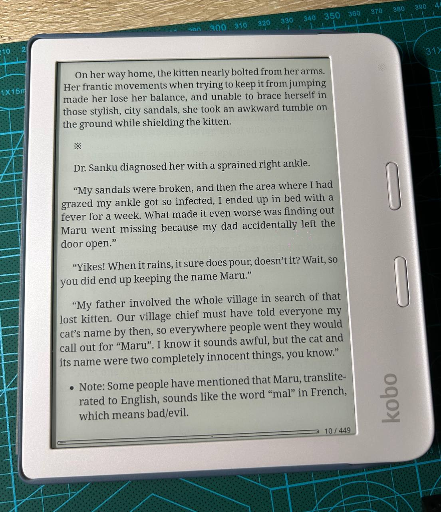
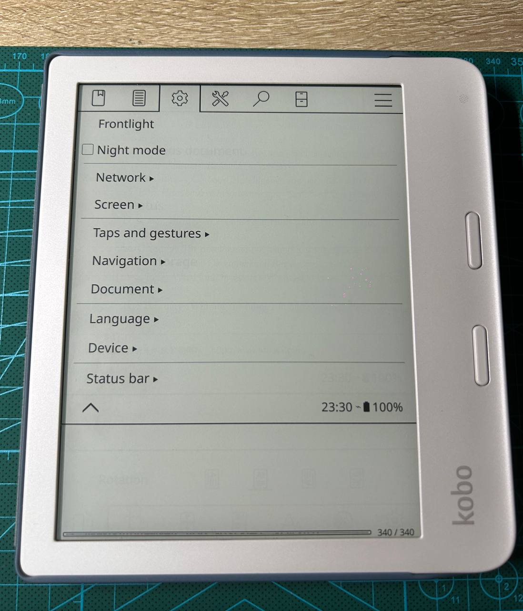

今年的六月初的时候赶着 618 活动入手了 Kobo Libra 2 电纸书，距离上次博客更新刚好过去一个月，想于是想着把 Kobo Libra 2 安装 KOReader 踩坑的记录写在这里刚好可以水一篇博客。

<!--more-->



> 这首歌很魔性……



Kobo 安装 KOReader 的教程可以参照 [KOReader Wiki](https://github.com/koreader/koreader/wiki/Installation-on-Kobo-devices)。

## Important Notes

首先把 Kobo 连接到电脑，用文本编辑器打开 `.kobo/Kobo/Kobo eReader.conf`，确保存在以下配置文件，禁止阅读器加载隐藏文件夹中的内容：

```
[FeatureSettings]
ExcludeSyncFolders=(\\.(?!kobo|adobe).+|([^.][^/]*/)+\\..+)
```

## Manual Installation Methods

按照手动安装 KOReader 的步骤，有两种安装方式可选择：

1. 第一种是在 [KFMon](https://github.com/NiLuJe/kfmon) 的基础上安装 KOReader，需要先安装 KFMon，安装 KFMon 的教程以及文件的下载连接在[这里](http://www.mobileread.com/forums/showthread.php?t=274231)。

1. 除此之外另一种安装方法是基于 [NickelMenu](https://www.mobileread.com/forums/showthread.php?t=329525) 的方式安装 KOReader。

这里咱使用的是第二种基于 [NickelMenu](https://www.mobileread.com/forums/showthread.php?t=329525) 的方式安装 KOReader。

1. 首先下载 NickelMenu 的 [KoboRoot.tgz](https://github.com/pgaskin/NickelMenu/releases/latest/download/KoboRoot.tgz) 安装包，像升级系统那样把压缩包拖到 `.kobo` 文件夹内，弹出 USB 后 Kobo 会自动重新更新。安装完成后 Kobo 右下角菜单栏会多一个 `NickelMenu` 菜单。

1. 在 [此处](https://build.koreader.rocks/download/) 下载 KOReader 安装包，因为 Libra 2 等使用相似主板的电子书存在死机重启的不稳定 [Bug](https://github.com/koreader/koreader/issues/9806) 建议先下载包含修复此问题的 `nightly build`（[参考 Issue](https://github.com/koreader/koreader/pull/10771#issuecomment-1662928674)），文件名以 `koreader-kobo` 开头的为 Kobo 使用的安装包。

1. 再次将 Kobo 连接到电脑，将 KOReader 安装包解压到 `.adds` 目录下。

1. 新建 `.adds/nm/koreader` 文件，写入以下内容：

    ```
    menu_item:main:KOReader:cmd_spawn:quiet:exec /mnt/onboard/.adds/koreader/koreader.sh
    ```

1. 弹出 USB，等待设备同步完数据后，就可以在 Kobo 的右下角菜单栏中启动 KOReader 了。

## Known Issues

使用过程中只遇到一个 KOReader 的严重影响体验的问题，就是上面说的阅读过程中会经常死机重启，可以在 [这篇 Issue](https://github.com/koreader/koreader/issues/9806) 跟踪进度，目前可以尝试使用 [这个 Patch](https://github.com/koreader/koreader/pull/10771)，安装 `nightly build` 的安装包尝试解决。

## Others

贴几张看电纸书的效果图供参考，Kobo 的显示效果比咱之前用过的 KPW4 好太多了。图书的话基本是从网络上找盗版资源了，KOReader 能够对 PDF 重排所以对 PDF 的支持效果也比 Kindle 好很多。




