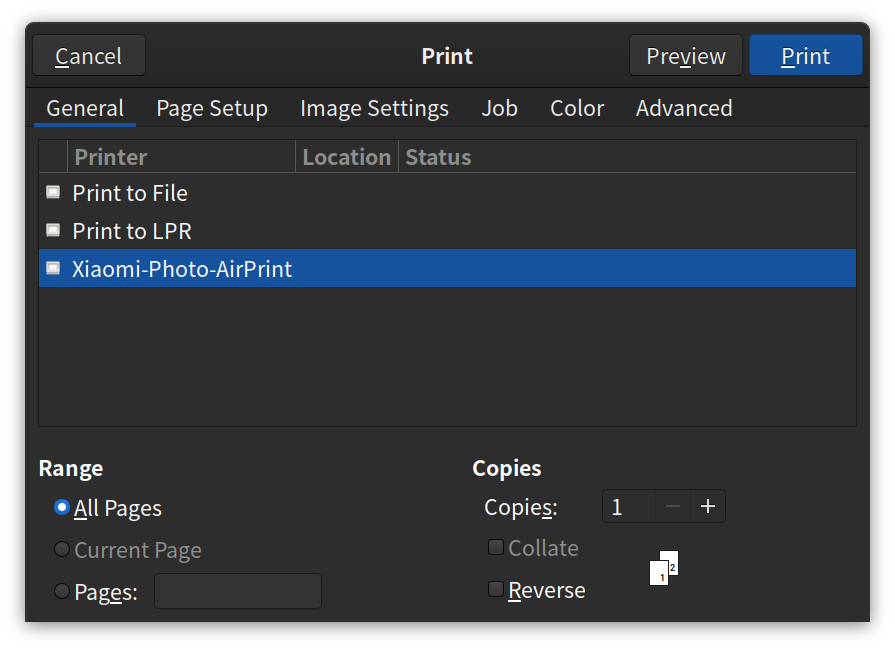
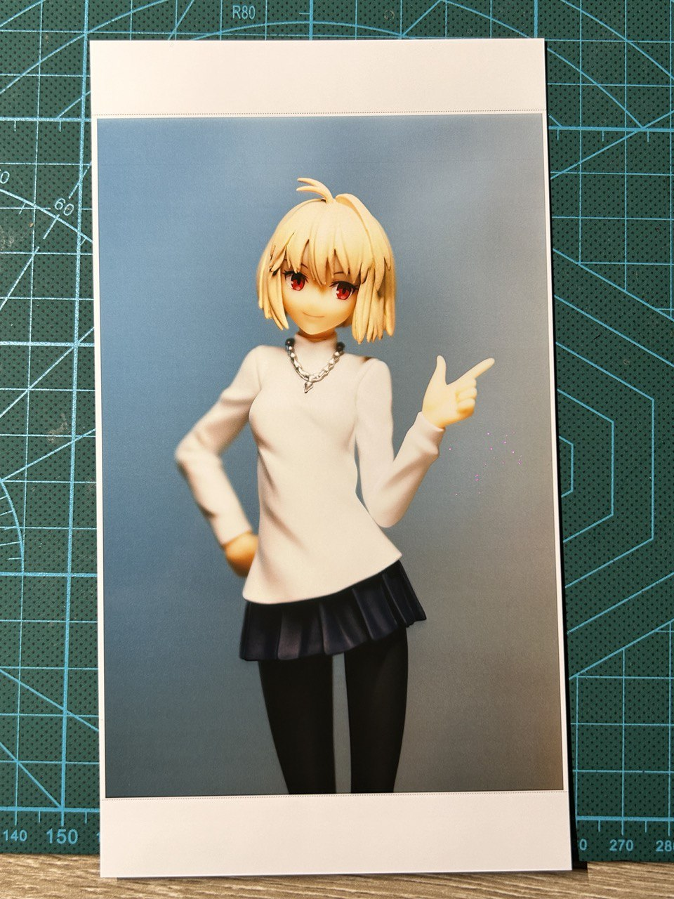

奇怪的反图方式增加了……

<!--more-->



----

> 参烤连接：[CUPS - ArchWiki](https://wiki.archlinux.org/title/CUPS#Permissions)。

安装 `CUPS` 和 `ghostscript`，启用 `cups.service`。

```console
$ sudo pacman -S cups
$ sudo systemctl enable --now cups.service
```

小米的这个照片打印机支持免驱 [AirPrint](https://en.wikipedia.org/wiki/AirPrint)，所以直接使用 `lpadmin` 添加打印机就行，不用安装驱动（也根本找不到对应的 Linux 驱动），只需要先在路由器中查询打印机的 IP 地址。

```console
$ sudo lpadmin -p "Xiaomi-Photo-AirPrint" -E -v "ipp://192.168.x.x/ipp/print" -m everywhere
```

之后打印照片时就可以选择已添加的打印机设备了。



初次打印时需要改一下打印的纸张大小为 4x6 英寸，不然照片尺寸会有问题，然后图片的质量可以改成最高。

照片打印出来会比屏幕上看到的更有内种感觉，打印的照片会有一些偏色，但个人认为这种色调害挺好看的。


