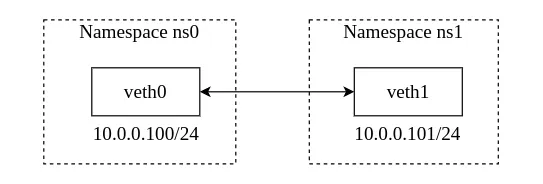
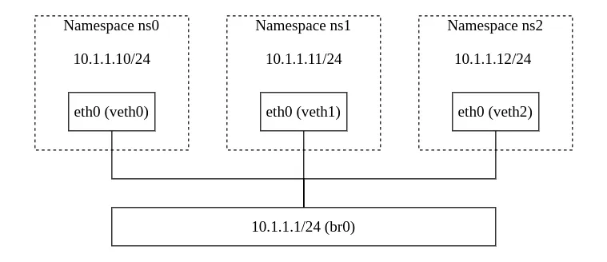

这篇博客稍微折腾一下容器网络相关的东西……

<!--more-->

## Linux 网络命名空间

在熟悉容器网络之前，首先来看一下 Linux 网络命名空间 (Network Namespace)这个东西。Linux 提供了多个不同种类的 Namespace，可以用 `lsns` 命令查看。

```console
$ lsns
        NS TYPE   NPROCS   PID USER     COMMAND
4026531834 time        2  2251 starry-s -zsh
4026531835 cgroup      2  2251 starry-s -zsh
4026531836 pid         2  2251 starry-s -zsh
4026531837 user        2  2251 starry-s -zsh
4026531838 uts         2  2251 starry-s -zsh
4026531839 ipc         2  2251 starry-s -zsh
4026531840 net         2  2251 starry-s -zsh
4026531841 mnt         2  2251 starry-s -zsh
...
```

参考 [network_namespace manpage](https://man7.org/linux/man-pages/man7/network_namespaces.7.html)，Network Namespace 是 Linux 实现网络虚拟化的功能，为同一个系统提供了网络资源隔离功能，不同的 Network Namespace 拥有不同的网卡、ARP、路由表等数据。可以使用 `iproute2` 工具的 `ip` 命令对 Linux Network Namespace 执行一系列的操作。

> 本篇介绍的指令不会系统产生损坏，但依旧建议在虚拟机或一个用于测试的系统上执行以下的 Network Namespace 相关操作，以便于执行重启等暴力操作。

查看设备中已有的 Network Namespace。

```console
$ ip netns list
$ ip netns ls
```

`ip netns` 命令会列出 `/var/run/netns/` 目录下存在的 Network Namespace，如果此前没有使用 `ip` 命令创建过 netns，以上命令不会有输出。首先我们创建两个 Network Namespace。

```console
$ sudo ip netns add ns0
$ sudo ip netns add ns1
$ sudo ip netns ls
ns0
ns1
$ ls /var/run/netns/
ns0 ns1
```

每个 Network Namespace 拥有不同的网卡、路由表、ARP 表等信息，可以使用 `ip -n [NAMESPACE]` 对某个 netns 进行操作，或通过 `ip netns exec` 在不同的 netns 下执行命令。

```console
$ sudo ip -n ns0 link
1: lo: <LOOPBACK> mtu 65536 qdisc noop state DOWN mode DEFAULT group default qlen 1000
    link/loopback 00:00:00:00:00:00 brd 00:00:00:00:00:00

$ sudo ip netns exec ns0 ip link
1: lo: <LOOPBACK> mtu 65536 qdisc noop state DOWN mode DEFAULT group default qlen 1000
    link/loopback 00:00:00:00:00:00 brd 00:00:00:00:00:00

$ sudo ip netns exec ns0 route
Kernel IP routing table
Destination     Gateway         Genmask         Flags Metric Ref    Use Iface

$ sudo ip netns exec ns0 arp
```

### veth pair 连接 Network Namespace

新建的 netns 只有一个回环接口，没有 ARP 和路由表信息，如果想在不同的 netns 之间通信，需要建立 veth pair（Virtual Cabel）。

可以使用 `ip link add type veth` 创建一对 veth pair，注意 veth pair 是成对出现的，可以在创建 veth pair 时指定这对 veth pair 名称。

首先看一下系统自带的接口信息，默认情况下系统有一个 `lo` 回环接口和一个 `eth0` (被重命名为 `enp*s*` 的接口)，如果运行了 Docker，还会有一个 `docker0` 接口。

```console
$ sudo ip link
1: lo: <LOOPBACK,UP,LOWER_UP> mtu 65536 qdisc noqueue state UNKNOWN mode DEFAULT group default qlen 1000
    link/loopback 00:00:00:00:00:00 brd 00:00:00:00:00:00
2: enp1s0: <BROADCAST,MULTICAST,UP,LOWER_UP> mtu 1500 qdisc fq_codel state UP mode DEFAULT group default qlen 1000
    link/ether ab:cd:ef:89:8f:f5 brd ff:ff:ff:ff:ff:ff
3: docker0: <NO-CARRIER,BROADCAST,MULTICAST,UP> mtu 1500 qdisc noqueue state DOWN mode DEFAULT group default 
    link/ether 02:42:b7:a9:6a:55 brd ff:ff:ff:ff:ff:ff
```

创建一对 veth pair 名为 `veth0` 和 `veth1`。

```console
$ sudo ip link add veth0 type veth peer name veth1
$ sudo ip link
......
4: veth1@veth0: <BROADCAST,MULTICAST,M-DOWN> mtu 1500 qdisc noop state DOWN mode DEFAULT group default qlen 1000
    link/ether 5e:7a:4e:96:b1:df brd ff:ff:ff:ff:ff:ff
5: veth0@veth1: <BROADCAST,MULTICAST,M-DOWN> mtu 1500 qdisc noop state DOWN mode DEFAULT group default qlen 1000
    link/ether 5e:5b:51:12:d0:b6 brd ff:ff:ff:ff:ff:ff
```

之后使用 `ip link set` 将这对 veth pair 分配到不同的 netns 中。

```console
$ sudo ip link set veth0 netns ns0
$ sudo ip link set veth1 netns ns1
$ sudo ip -n ns0 link
1: lo: <LOOPBACK> mtu 65536 qdisc noop state DOWN mode DEFAULT group default qlen 1000
    link/loopback 00:00:00:00:00:00 brd 00:00:00:00:00:00
5: veth0@if4: <BROADCAST,MULTICAST> mtu 1500 qdisc noop state DOWN mode DEFAULT group default qlen 1000
    link/ether 5e:5b:51:12:d0:b6 brd ff:ff:ff:ff:ff:ff link-netns ns1
$ sudo ip -n ns1 link
1: lo: <LOOPBACK> mtu 65536 qdisc noop state DOWN mode DEFAULT group default qlen 1000
    link/loopback 00:00:00:00:00:00 brd 00:00:00:00:00:00
4: veth1@if5: <BROADCAST,MULTICAST> mtu 1500 qdisc noop state DOWN mode DEFAULT group default qlen 1000
    link/ether 5e:7a:4e:96:b1:df brd ff:ff:ff:ff:ff:ff link-netns ns0
```

使用 `ip addr add` 为 veth pair 接口创建 IP 地址，并使用 `ip link set [INTERFACE] up` 启动网卡接口。

```console
$ sudo ip -n ns0 addr add 10.0.0.100/24 dev veth0
$ sudo ip -n ns1 addr add 10.0.0.101/24 dev veth1
$ sudo ip -n ns0 link set veth0 up
$ sudo ip -n ns1 link set veth1 up
$ sudo ip -n ns0 addr
1: lo: <LOOPBACK> mtu 65536 qdisc noop state DOWN group default qlen 1000
    link/loopback 00:00:00:00:00:00 brd 00:00:00:00:00:00
5: veth0@if4: <BROADCAST,MULTICAST,UP,LOWER_UP> mtu 1500 qdisc noqueue state UP group default qlen 1000
    link/ether 5e:5b:51:12:d0:b6 brd ff:ff:ff:ff:ff:ff link-netns ns1
    inet 10.0.0.100/24 scope global veth0
       valid_lft forever preferred_lft forever
    inet6 fe80::5c5b:51ff:fe12:d0b6/64 scope link proto kernel_ll 
       valid_lft forever preferred_lft forever
$ sudo ip -n ns1 addr
1: lo: <LOOPBACK> mtu 65536 qdisc noop state DOWN group default qlen 1000
    link/loopback 00:00:00:00:00:00 brd 00:00:00:00:00:00
4: veth1@if5: <BROADCAST,MULTICAST,UP,LOWER_UP> mtu 1500 qdisc noqueue state UP group default qlen 1000
    link/ether 5e:7a:4e:96:b1:df brd ff:ff:ff:ff:ff:ff link-netns ns0
    inet 10.0.0.101/24 scope global veth1
       valid_lft forever preferred_lft forever
    inet6 fe80::5c7a:4eff:fe96:b1df/64 scope link proto kernel_ll 
       valid_lft forever preferred_lft forever
```

`ip addr add` 命令在添加 IP 地址时会自动创建路由表信息。现在两个 netns 之间可通过 veth pair 互相通信。

```console
$ sudo ip -n ns0 route
10.0.0.0/24 dev veth0 proto kernel scope link src 10.0.0.100 
$ sudo ip -n ns1 route
10.0.0.0/24 dev veth1 proto kernel scope link src 10.0.0.101 
$ sudo ip netns exec ns0 ping -c 1 10.0.0.101
PING 10.0.0.101 (10.0.0.101) 56(84) bytes of data.
64 bytes from 10.0.0.101: icmp_seq=1 ttl=64 time=0.051 ms

--- 10.0.0.101 ping statistics ---
1 packets transmitted, 1 received, 0% packet loss, time 0ms
rtt min/avg/max/mdev = 0.051/0.051/0.051/0.000 ms
$ sudo ip netns exec ns1 ping -c 1 10.0.0.100
PING 10.0.0.100 (10.0.0.100) 56(84) bytes of data.
64 bytes from 10.0.0.100: icmp_seq=1 ttl=64 time=0.040 ms

--- 10.0.0.100 ping statistics ---
1 packets transmitted, 1 received, 0% packet loss, time 0ms
rtt min/avg/max/mdev = 0.040/0.040/0.040/0.000 ms
```

到这里，`ns0` 和 `ns1` 两个 Network Namespace 之间的拓扑图如下。



### 使用 bridge 连接多个 Network Namespace

veth pair 只能用于两个 netns 之间的通信，如果需要多个 netns 访问到同一个网络中，需要配置桥接网络。

重启系统，之后重新建立 `ns0`, `ns1` 和 `ns2` 三个 Network Namespace。

```console
$ sudo ip netns add ns0
$ sudo ip netns add ns1
$ sudo ip netns add ns2
```

使用 `ip link add` 创建一个桥接接口，并建立三对 veth pair，用于连接 `br0` 和上述三个 netns。

```console
$ sudo ip link add br0 type bridge
$ sudo ip link add veth0-br type veth peer name veth0
$ sudo ip link add veth1-br type veth peer name veth1
$ sudo ip link add veth2-br type veth peer name veth2
$ ip link
...
4: br0: <BROADCAST,MULTICAST> mtu 1500 qdisc noop state DOWN mode DEFAULT group default qlen 1000
    link/ether be:60:00:25:c5:37 brd ff:ff:ff:ff:ff:ff
5: veth0@veth0-br: <BROADCAST,MULTICAST,M-DOWN> mtu 1500 qdisc noop state DOWN mode DEFAULT group default qlen 1000
    link/ether 5e:5b:51:12:d0:b6 brd ff:ff:ff:ff:ff:ff
6: veth0-br@veth0: <BROADCAST,MULTICAST,M-DOWN> mtu 1500 qdisc noop state DOWN mode DEFAULT group default qlen 1000
    link/ether 72:01:3d:42:16:8c brd ff:ff:ff:ff:ff:ff
7: veth1@veth1-br: <BROADCAST,MULTICAST,M-DOWN> mtu 1500 qdisc noop state DOWN mode DEFAULT group default qlen 1000
    link/ether 5e:7a:4e:96:b1:df brd ff:ff:ff:ff:ff:ff
8: veth1-br@veth1: <BROADCAST,MULTICAST,M-DOWN> mtu 1500 qdisc noop state DOWN mode DEFAULT group default qlen 1000
    link/ether 1e:13:96:f1:b6:9d brd ff:ff:ff:ff:ff:ff
9: veth2@veth2-br: <BROADCAST,MULTICAST,M-DOWN> mtu 1500 qdisc noop state DOWN mode DEFAULT group default qlen 1000
    link/ether 62:13:73:b6:5d:f9 brd ff:ff:ff:ff:ff:ff
10: veth2-br@veth2: <BROADCAST,MULTICAST,M-DOWN> mtu 1500 qdisc noop state DOWN mode DEFAULT group default qlen 1000
    link/ether f2:e6:df:92:de:71 brd ff:ff:ff:ff:ff:ff
```

把 `veth0`, `veth1`, `veth2` 分别放到 `ns0`, `ns1` 和 `ns2` 三个 Network Namespace 中，并将他们重命名为 `eth0`。

```console
$ sudo ip link set dev veth0 netns ns0
$ sudo ip link set dev veth1 netns ns1
$ sudo ip link set dev veth2 netns ns2
$ sudo ip -n ns0 link set dev veth0 name eth0
$ sudo ip -n ns1 link set dev veth1 name eth0
$ sudo ip -n ns2 link set dev veth2 name eth0
```

并把 `veth0-br`, `veth1-br`, `veth2-br` 分别连接到 `br0` 桥接网卡中。

```console
$ sudo ip link set dev veth0-br master br0
$ sudo ip link set dev veth1-br master br0
$ sudo ip link set dev veth2-br master br0
```

启用所有的网卡接口（为了能 ping 通每个 netns 的 `127.0.0.1`，将每个 ns 的 `lo` 回环接口也启动）。

```console
$ sudo ip link set dev br0 up
$ sudo ip link set veth0-br up
$ sudo ip link set veth1-br up
$ sudo ip link set veth2-br up
$ sudo ip -n ns0 link set eth0 up
$ sudo ip -n ns1 link set eth0 up
$ sudo ip -n ns2 link set eth0 up
$ sudo ip -n ns0 link set lo up
$ sudo ip -n ns1 link set lo up
$ sudo ip -n ns2 link set lo up
```

为 `br0` 和 netns 中的 veth 接口 （`eth0`）添加 IP 地址。

```console
$ sudo ip addr add 10.1.1.1/24 dev br0
$ sudo ip -n ns0 addr add 10.1.1.10/24 dev eth0
$ sudo ip -n ns1 addr add 10.1.1.11/24 dev eth0
$ sudo ip -n ns2 addr add 10.1.1.12/24 dev eth0
```

查看一下 `br0` 和 netns 中的 `eth0` 接口的 IP 地址。

```console
$ ip a
...
4: br0: <BROADCAST,MULTICAST> mtu 1500 qdisc noop state DOWN group default qlen 1000
    link/ether be:60:00:25:c5:37 brd ff:ff:ff:ff:ff:ff
    inet 10.0.0.1/24 scope global br0
       valid_lft forever preferred_lft forever
6: veth0-br@if5: <BROADCAST,MULTICAST,UP,LOWER_UP> mtu 1500 qdisc noqueue master br0 state UP group default qlen 1000
    link/ether 72:01:3d:42:16:8c brd ff:ff:ff:ff:ff:ff link-netns ns0
    inet6 fe80::7001:3dff:fe42:168c/64 scope link proto kernel_ll 
       valid_lft forever preferred_lft forever
8: veth1-br@if7: <BROADCAST,MULTICAST,UP,LOWER_UP> mtu 1500 qdisc noqueue master br0 state UP group default qlen 1000
    link/ether 1e:13:96:f1:b6:9d brd ff:ff:ff:ff:ff:ff link-netns ns1
    inet6 fe80::1c13:96ff:fef1:b69d/64 scope link proto kernel_ll 
       valid_lft forever preferred_lft forever
10: veth2-br@if9: <BROADCAST,MULTICAST,UP,LOWER_UP> mtu 1500 qdisc noqueue master br0 state UP group default qlen 1000
    link/ether f2:e6:df:92:de:71 brd ff:ff:ff:ff:ff:ff link-netns ns2
    inet6 fe80::f0e6:dfff:fe92:de71/64 scope link proto kernel_ll 
       valid_lft forever preferred_lft forever
$ sudo ip -n ns0 a
5: eth0@if6: <BROADCAST,MULTICAST,UP,LOWER_UP> mtu 1500 qdisc noqueue state UP group default qlen 1000
    link/ether 5e:5b:51:12:d0:b6 brd ff:ff:ff:ff:ff:ff link-netnsid 0
    inet 10.1.1.10/24 scope global eth0
       valid_lft forever preferred_lft forever
    inet6 fe80::5c5b:51ff:fe12:d0b6/64 scope link proto kernel_ll 
       valid_lft forever preferred_lft forever
$ sudo ip -n ns1 a
7: eth0@if8: <BROADCAST,MULTICAST,UP,LOWER_UP> mtu 1500 qdisc noqueue state UP group default qlen 1000
    link/ether 5e:7a:4e:96:b1:df brd ff:ff:ff:ff:ff:ff link-netnsid 0
    inet 10.1.1.11/24 scope global eth0
       valid_lft forever preferred_lft forever
    inet6 fe80::5c7a:4eff:fe96:b1df/64 scope link proto kernel_ll 
       valid_lft forever preferred_lft forever
$ sudo ip -n ns2 a
9: eth0@if10: <BROADCAST,MULTICAST,UP,LOWER_UP> mtu 1500 qdisc noqueue state UP group default qlen 1000
    link/ether 62:13:73:b6:5d:f9 brd ff:ff:ff:ff:ff:ff link-netnsid 0
    inet 10.1.1.12/24 scope global eth0
       valid_lft forever preferred_lft forever
    inet6 fe80::6013:73ff:feb6:5df9/64 scope link proto kernel_ll 
       valid_lft forever preferred_lft forever
```

此时在主机上可以 ping 通三个 netns 的 IP 地址。

```console
$ ping -c 1 10.1.1.10
PING 10.1.1.10 (10.1.1.10) 56(84) bytes of data.
64 bytes from 10.1.1.10: icmp_seq=1 ttl=64 time=0.130 ms
$ ping -c 1 10.1.1.11
PING 10.1.1.11 (10.1.1.11) 56(84) bytes of data.
64 bytes from 10.1.1.11: icmp_seq=1 ttl=64 time=0.117 ms
$ ping -c 1 10.1.1.12
PING 10.1.1.12 (10.1.1.12) 56(84) bytes of data.
64 bytes from 10.1.1.12: icmp_seq=1 ttl=64 time=0.119 ms
```

三个 netns 也可以访问主机的 IP 地址 `10.1.1.1`。

```console
$ sudo ip netns exec ns0 ping -c 1 10.1.1.1
PING 10.1.1.1 (10.1.1.1) 56(84) bytes of data.
64 bytes from 10.1.1.1: icmp_seq=1 ttl=64 time=0.076 ms
$ sudo ip netns exec ns1 ping -c 1 10.1.1.1
PING 10.1.1.1 (10.1.1.1) 56(84) bytes of data.
64 bytes from 10.1.1.1: icmp_seq=1 ttl=64 time=0.071 ms
$ sudo ip netns exec ns2 ping -c 1 10.1.1.1
PING 10.1.1.1 (10.1.1.1) 56(84) bytes of data.
64 bytes from 10.1.1.1: icmp_seq=1 ttl=64 time=0.072 ms
```

默认情况下 Linux 会把 bridge 的二层转发（交换机）功能禁用掉，因此不同的 netns 之间仍无法互相访问。

```console
$ sudo ip netns exec ns0 ping -c 1 -W 5 10.1.1.11
PING 10.1.1.11 (10.1.1.11) 56(84) bytes of data.

--- 10.1.1.11 ping statistics ---
1 packets transmitted, 0 received, 100% packet loss, time 0ms
```

使用 IP 桌子，激活桥接接口的转发功能。

```console
$ sudo iptables -A FORWARD -i br0 -j ACCEPT
```

此时不同的 netns 之间可以互相 ping 通了。

```console
$ sudo ip netns exec ns0 ping 10.1.1.12
PING 10.1.1.12 (10.1.1.12) 56(84) bytes of data.
64 bytes from 10.1.1.12: icmp_seq=1 ttl=64 time=0.148 ms
```


到这里，三个 netns 可以通过 `10.1.1.0/24` 这一个网段互相访问，此时的网络拓扑图变为。




但是目前 netns 无法访问其他网段的 IP 地址。

```console
$ sudo ip netns exec ns0 ping -c 1 8.8.8.8
ping: connect: Network is unreachable
```

若需要访问其他网段，则需要将主机的网卡（咱这里为 `enp1s0`，不同系统可能不一样）也添加到将桥接网卡 `br0` 中，并为 netns 配置默认网关 `10.1.1.1/24`，还要再次使用 IP 桌子配置 NAT。

```console
$ sudo ip link set enp1s0 master br0
$ sudo iptables --table nat -A POSTROUTING -s 10.1.1.0/24 -j MASQUERADE
$ sudo ip -n ns0 route add default via 10.1.1.1
$ sudo ip -n ns1 route add default via 10.1.1.1
$ sudo ip -n ns2 route add default via 10.1.1.1
```

查看一下 netns 中的路由表，这时的默认流量会走 `10.1.1.1` 网关。

```console
$ sudo ip -n ns0 route
default via 10.1.1.1 dev eth0 
10.1.1.0/24 dev eth0 proto kernel scope link src 10.1.1.10
```

到这里不出意外的话，netns 已经具备访问公网的能力了。

```console
$ sudo ip netns exec ns0 ping -c 1 8.8.8.8
PING 8.8.8.8 (8.8.8.8) 56(84) bytes of data.
64 bytes from 8.8.8.8: icmp_seq=1 ttl=112 time=66.0 ms

--- 8.8.8.8 ping statistics ---
1 packets transmitted, 1 received, 0% packet loss, time 0ms
rtt min/avg/max/mdev = 65.964/65.964/65.964/0.000 ms
```

## 容器网络

> To Be Continued...
