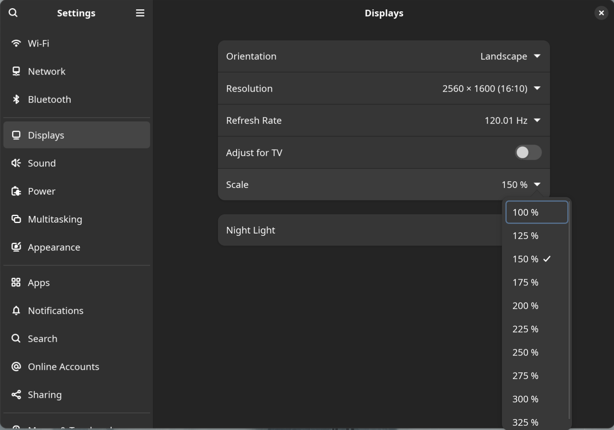

本来没打算这么早换笔记本，但是之前大学时买的联想 R7000P 它坏了……

<!--more-->

----



## 起因

> 这段基本是废话，可以直接跳过……

旧笔记本经常蓝屏死机掉驱动重启，送修过一次但依旧没修好，于是把它当有问题的二手电脑卖掉了，买了今年新出的联想 ThinkBook 16 Gen6。因为咱有台式，所以笔记本的需求就是轻薄，Linux 友好，便宜就行。之前总是被笔记本的双显卡驱动折磨得头疼，英伟达显卡驱动 4202 年了依旧是那么的拉跨，相同规格的 AMD 版本比 Intel 便宜好几百，所以最终选的这个能 PD 充电，只有 AMD 集显，8 核 16 线程 32G 内存的电脑，只想拿它写代码，本地跑编译，跑 KVM 虚拟机用（稍微吐嘈一下某 ARM 架构的电脑，KVM 虚拟机各种限制，想建一个 NAT 类型的 Libvirt Network 都不行）。

为避免引战，这里先只说一下咱个人的观点，可能是因为折腾 Linux 系统时间很久了吧所以对咱来说最舒服的系统还是 Linux，咱很赞同 Linus TechTips 这个视频里对 macOS 的吐嘈，因为 Win/Linux 与 macOS 的键盘、快捷键、手势操作、鼠标指针加速度不一致，所以想同时适应两套不同的手势快捷键、鼠标加速度很是让人头疼。不过这些在倒是能在长时间的适应之后通过修改系统设置的快捷键布局、安装第三方的鼠标加速度修复工具、和第三方输入法来缓解。

<iframe src="//player.bilibili.com/player.html?isOutside=true&aid=563073437&bvid=BV1Rv4y127d5&cid=904126423&p=1" scrolling="no" border="0" frameborder="no" framespacing="0" allowfullscreen="true"></iframe>

咳，还是要再强调一下，咱只是个人觉得水果的电脑不太好用，尤其是需要 Mac + Win + Linux 来回切换着使用的情况下，很折磨。加上咱眼睛对 LED 的低频 PWM 调光敏感，所以显示设备都尽可能的买低蓝光的 DC 调光 LCD 屏了。

## 安装 Arch Linux

其实咱是直接把之前的 R7000p 的硬盘拆下来装到 Thinkbook 16 的第二硬盘插槽里了，所以没有重装系统的步骤，卸载掉 NVIDIA 驱动，改了 SWAP 分区大小就可以用，不需要再配置双显卡切换的工具，没遇到什么奇葩的问题。

### Wayland

因为 16 寸的 2K 屏幕，不调缩放的情况下显示的图标和字会特别小，所以需要启用分数倍缩放。X11 只能整数倍缩放，但笔记本只有一个 AMD GPU，所以可以完美使用 Wayland（没有英伟达显卡真的太爽了哈哈哈哈hhh）。



切换到 Wayland 并启用 150% 的分数倍缩放后，终于不需要再拿显微镜看屏幕的图标和文字了，但很快就会发现 Chrome 和 Election 的应用的文字全是模糊的，强迫症当然不能忍，查了一下发现原来虽然系统切到 Wayland 了，但这些应用依旧在使用 X 没有切换成 Wayland。

所以对于 Chrome，需要创建 `~/.config/chrome-flags.conf` 加几个 Flag 使用 GTK4。

```
--gtk-version=4 --ozone-platform=wayland --enable-wayland-ime
```

那些基于 Electron 的应用，例如 Visual Studio Code，设置 `~/.config/code-flags.conf`：

```
--gtk-version=4 --enable-wayland-ime
```

然后如果你是 GNOME 用户，你会发现把 Chrome/Election 切换到 Wayland 后没办法使用第三方输入法，因为 GNOME 不支持 `text-input-v1` 而 Chromium 只支持 `text-input-v3`，所以对于这个问题，目前的 Workaround 是安装 `archlinuxcn/mutter-performance` 替换掉 GNOME 的 `mutter`。

不过这个不是十分完美的解决方法，VSCode 在启动多个窗口，放到不同的 Workspace 里会遇到鼠标右键点不开和输入法的问题，不过勉强能接受，所以不管了（或者我最近在考虑要不要换一个文本编辑器而不是 VSCode）。

然后就是 Chromium 最近好像在支持 `text-input-v3` 了，所以别骂了别骂了，不要再黑 GNOME 了……

----

所以现在就是，每新安装一个 Election 应用，都得给他创建个 `~/.config/[NAME].conf`……

```
--enable-wayland-ime
```

## 吐嘈

以后再买笔记本时要多留意一下，尽量别买高分屏（但现在中高端本全是高分屏），还要避免双显卡，一旦买了双显卡的电脑大概率没办法用 Wayland，还要多花好多时间折腾双显卡混合交火，还得规避掉英伟达新版本驱动会 Kernel Panic 的 Bug。

一旦你买了双显卡高分屏笔记本，那么恭喜你只能用 X11，没有分数倍缩放，所以你只需要准备一个放大镜用来看屏幕就能解决问题（确信）。
