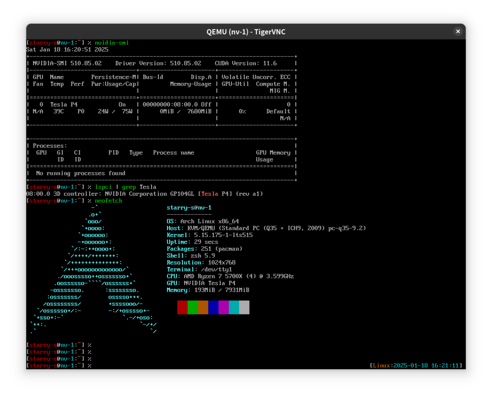

又买了一堆电子垃圾，折腾了一台家用的服务器。

<!--more-->



----

两年前，咱折腾了一台 ITX 主机作为 NAS 使用，以存储这几年相机拍的照片。不过一台迷你 ITX NAS 主机能运行的虚拟机数量已经满足不了咱对于折腾的需求了，于是又捡了些垃圾配件组了个配置差不多的 M-ATX 台式电脑，作为咱的服务器使用。

配置清单：
- 主板：华硕 B550M PLUS 重炮手
- CPU：AMD R7 5700X
- 内存：旧电脑上拆下来的镁光 DDR4 3200 8G * 4
- GPU：NVIDIA Tesla P4
- 硬盘：国产的杂牌 PCIE 3.0 速率的 NVME 固态，容量 2 TB
- 机箱：先马平头哥 M2 MESH
- 一些静音风扇
- 散热为旧电脑上换下来的双塔散热

因为是拿二手的电脑配件拼的电脑，CPU 也是买的是散片，内存用的是旧电脑上拆的 8G 条子，所以这个服务器有点灵车的性质，咱也不知道它能不能稳定运行，不过它并不作为 NAS 使用，不需要备份重要文件，所以稳定性不是非常重要，咱也没有给他配 UPS 备用电源。除此之外，因为是家用的服务器，所以选的无集显的 AMD 5700X CPU，插上了一个无视频输出的服务器 GPU 卡。装机过程中虽然主板插上了这个服务器显卡，但因为显卡没有视频输出接口，CPU 也没有集显，所以主板开机启动时 VGA 自检灯会一直白色常亮报警。不过搜了一下 NGA 论坛上的讨论，华硕的 550/570 系列的这个 AMD 主板的 BIOS 里虽然没有显卡无头启动的选项开关，但默认是已经支持无头启动了，虽然自检的 VGA 灯会一直白色常亮，但系统可以正常启动，只是显示器一直黑屏，没有画面输出（BIOS 也不能显示）。

于是在装系统时，咱把之前装机时买的 GT730D 亮机卡插上去，进 BIOS 关掉亮瞎眼的 ARGB 灯，启用 SVM，配置好内存频率和 UEFI 启动，关掉安全启动，设置风扇为静音模式。之后用 U 盘把系统安装好，写好网络配置文件并启用 SSH 远程连接，之后关机（PCIE 不支持热插拔一定要关机再拔卡）把显卡换成没有视频输出的 Tesla P4。这样一台“无头”，但有 GPU 的服务器就装好了。

> 其实咱试过要不要把这个 GT730D 亮机卡和 Tesla P4 一起插在主板上，因为毕竟这个主板有两个 PCIE x16 的槽子，一个是 PCIE 4.0，另一个是 PCIE 3.0。但是 GT730D 只支持 nvidia-470xx 版本的驱动（或 nouveau），Tesla P4 尽管不支持近几年新出的 nvidia-open 开源驱动（这个驱动只支持近几年新出的 Turing 图灵系列的卡而 P4 是 Pascal 架构）， 所以咱不想装太旧的显卡驱动于是只好在装机配置电脑的过程中无数次关机，开机箱换显卡……

## GPU Passthrough

为了能够在虚拟机里也能使用 GPU 资源，有一种方式是可以通过 GPU Passthrough 的方式将显卡设备直通至 KVM 虚拟机，在折腾 vGPU 之前，先试一下 Single GPU Passthrough。

### IOMMU Group

参照 [Arch Wiki](https://wiki.archlinux.org/title/PCI_passthrough_via_OVMF)，主板在开启 SVM 后，默认就启用了 AMD VT-d 虚拟化并支持 IOMMU，所以默认情况下不需要配置 `vfio`，直接执行[这个 `iommu.sh` 脚本](https://wiki.archlinux.org/title/PCI_passthrough_via_OVMF#Ensuring_that_the_groups_are_valid)就可以查看 PCIE 设备对应的 IOMMU Group。

```console
$ sudo dmesg | grep AMD-Vi
[    0.796858] pci 0000:00:00.2: AMD-Vi: IOMMU performance counters supported
[    0.799440] AMD-Vi: Extended features (0x58f77ef22294a5a, 0x0): PPR NX GT IA PC GA_vAPIC
[    0.799447] AMD-Vi: Interrupt remapping enabled

$ sudo dmesg | grep IOMMU
[    0.741773] perf/amd_iommu: Detected AMD IOMMU #0 (2 banks, 4 counters/bank).

$ iommu.sh
...
IOMMU Group 14:
	07:00.0 3D controller [0302]: NVIDIA Corporation GP104GL [Tesla P4] [10de:1abc] (rev a1)
...

```

咱的 Tesla P4 显卡插在华硕 B550M 重炮手的 PCIE 4.0x16 插槽上，执行 `iommu.sh` 可以看到 Tesla P4 这个卡只在一个 `IOMMU Group 14` 这个 Group 里面，因为显卡没有输出接口所以这个 Group 里也没有音频输出的 Audio Device。

注意不能将显卡插在主板的 PCIE 3.0x16 插槽里，如果这么弄的话，这个卡设备会和 CPU 等好多主板设备共用一个 Group，这样就没办法只将显卡设备直通到虚拟机里。

除此之外因为服务器只有一块显卡，所以当显卡被直通到虚拟机后，服务器将不能运行 X Server，且一个显卡只能直通给一个虚拟机使用，不能分成多个 vGPU。在这篇 [Single GPU Passhrough Wiki](https://gitlab.com/risingprismtv/single-gpu-passthrough/-/wikis/2%29-Editing-your-Bootloader) 里介绍可以加内核参数 `video=efifb:off`，避免显卡设备从虚拟机返回到主机时遇到问题。

### 配置 libvirt

服务器上面只有一块显卡，且这块卡要被直通给虚拟机使用，所以服务器不能跑 X Server 图形界面，也就是说只能手动配置 libvirt 的 Domain XML 启动虚拟机。或者先跑起来一个 VNC Server，使用 `virt-manager` 创建好虚拟机之后，再停掉 VNC Server 并 `rmmod` 主机上已加载显卡驱动内核模块。

libvirt 的安装和配置教程可以直接参照 [Wiki](https://wiki.archlinux.org/title/Libvirt)，这里不再赘述。

最后编辑需要直通显卡设备的虚拟机 Domain XML，参照这里[移除掉 Virtual Display](https://gitlab.com/risingprismtv/single-gpu-passthrough/-/wikis/8%29-Attaching-the-GPU-to-your-VM#removing-the-virtual-display)，然后添加一段 `hostdev` 将主机的显卡设备直通到虚拟机。

```xml
<hostdev mode="subsystem" type="pci" managed="yes">
    <source>
        <address domain="0x0000" bus="0x07" slot="0x00" function="0x0"/>
    </source>
    <address type="pci" domain="0x0000" bus="0x07" slot="0x00" function="0x0"/>
</hostdev>
```

这里咱的显卡为 `07:00.0`，对应 XML 中的 `domain="0x0000" bus="0x07" slot="0x00" function="0x0"`。

因为显卡被直通给虚拟机，所以主机上不能运行 X Server，如果 libvirt 在启动虚拟机时卡住，可能是因为显卡驱动还在被主机加载，显卡设备依旧被主机使用而无法被直通给虚拟机。
这是可以执行 `rmmod` 重新加载显卡驱动，让主机让出显卡给虚拟机使用。

```sh
#!/bin/bash

# reload-nvidia.sh
sudo rmmod nvidia_drm nvidia_uvm nvidia_modeset nvidia
sudo modprobe nvidia nvidia_uvm
```

虚拟机启动后，需要通过 SSH 连接到虚拟机，或通过虚拟机的 VNC 图形界面连接到虚拟机，之后在虚拟机里安装好 `nvidia` 驱动，就可以看到一整块的显卡设备都被直通给这个虚拟机里了。



## vGPU 分割显卡

Single GPU Passthrough 的局限很明显，只能将显卡直通给一个虚拟机独享，且这期间主机不能使用图形界面。所以可以用 NVIDIA 的 vGPU 将显卡分为多个“虚拟的小卡”，这样每个虚拟机都有显卡资源使用，肥肠适合在虚拟机中模拟 GPU 集群的开发等折腾场景。

NVIDIA vGPU 驱动为付费使用，可以申请 90 天试用，vGPU 的驱动获取方式这里不赘述。

因为 Tesla P4 仅支持 G16 及之前版本的 vGPU 驱动，Arch Linux 的 `linux` 内核版本很别新，且 GCC 版本为 14，英伟达的 vGPU 驱动并没有已编译好的可直接无痛安装的版本，于是只能用 The Hard Way 来编译 NVIDIA 驱动内核模块了。

```sh
# 卸载已安装的显卡驱动
pacman -R nvidia nvidia-utils

#  解压显卡驱动安装文件
./NVIDIA-Linux-x86_64-535.xxx-vgpu-kvm.run -x
cd NVIDIA-Linux-x86_64*/

# 编译 DKMS 内核模块并安装
./nvidia-installer --dkms
```

首先需要解决一下 `error: implicit declaration of function 'follow_pfn'; did you mean 'folio_pfn'?` 报错，新版的内核移除了 `follow_pfn`，所以要参照[这里](https://forums.developer.nvidia.com/t/gpl-only-symbols-follow-pte-and-rcu-read-unlock-prevent-470-256-02-to-build-with-kernel-6-10/300052)手动改下代码。

1. 编辑 `kernel/conftest.sh`，修改 `unsafe_follow_pfn` 为 `follow_pfn`。

    ```sh
            follow_pfn)
                #
                # Determine if follow_pfn() is present.
                #
                # follow_pfn() was added by commit 69bacee7f9ad
                # ("mm: Add follow_pfn") in v5.13-rc1.
                #
                CODE="
                #include <linux/mm.h>
                void conftest_follow_pfn(void) {
                    follow_pfn();
                }"

                compile_check_conftest "$CODE" "NV_FOLLOW_PFN_PRESENT" "" "functions"
            ;;
    ```

1. 编辑 `kernel/nvidia/nvidia.Kbuild`，改成 `follow_pfn`。

    ```
    NV_CONFTEST_FUNCTION_COMPILE_TESTS += follow_pfn
    ```

1. 编辑 `kernel/nvidia/os-mlock.c` 的 `nv_follow_pfn` 函数，修改为这样子。

    ```c
        static inline int nv_follow_pfn(struct vm_area_struct *vma,
                                        unsigned long address,
                                        unsigned long *pfn)
        {
        #if defined(NV_FOLLOW_PFN_PRESENT)
            return follow_pfn(vma, address, pfn);
        #else
            return -1;
        #endif
        }
    ```

之后再编译时还会遇到 `error: 'no_llseek' undeclared here (not in a function); did you mean 'noop_llseek'?` 报错，搜了一下发现在 Kernel 6.12 中 `no_llseek` [已被移除](https://github.com/google/gasket-driver/commit/4b2a1464f3b619daaf0f6c664c954a42c4b7ce00.patch)，
可以直接编辑 `kernel/nvidia-vgpu-vfio/nvidia-vgpu-vfio.c` [移除掉有 `no_llseek` 的行](https://lore.kernel.org/linux-next/20220715140259.205ef267@canb.auug.org.au/)。

然后在加载编译后的内核驱动模块时会遇到 `failing symbol_get of non-GPLONLY symbol nvidia_vgpu_vfio_get_ops.` 报错。这里为了能让内核模块被加载到内核里，只能编辑 `kernel/nvidia/nv-vgpu-vfio-interface.c` 将 `EXPORT_SYMBOL(nvidia_vgpu_vfio_get_ops)` 改成 `EXPORT_SYMBOL_GPL(nvidia_vgpu_vfio_get_ops)`，将 `EXPORT_SYMBOL(nvidia_vgpu_vfio_set_ops)` 改成 `EXPORT_SYMBOL_GPL(nvidia_vgpu_vfio_set_ops)`。尽管并不建议直接把非 GPL Symbol 改成 GPL，但如果要在最新的内核版本中安装这个驱动，只能这么修改，或者试着降级至某个 `linux-lts` 版本，不过降级至其他 LTS 版本还需要手动解决 LTS 版本内核编译时遇到的依赖冲突问题……

驱动安装好之后，就可以参照[这个步骤](https://documentation.suse.com/sles/15-SP6/html/SLES-all/article-nvidia-vgpu.html#configure-nvidia-vgpu-passthrough)，将显卡的 `mdev` 设备分给虚拟机使用了。

> 未完待续