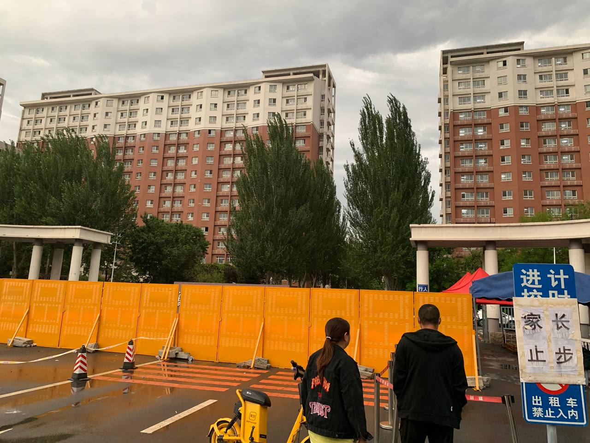

<!--more-->



## June

实在是不想以“时间过得真快啊”这种烂大街的句子作为开头，但是我实在想不出什么更好听的句子出来。

距离我当时高考结束已经过去了4年，从初中毕业到现在已经过去了7年。

大四下半年的这段时间一直在校外实习，之后抽时间做毕业设计。因为疫情，校外的学生直到毕业都没办法再回学校一趟。

因为一直在校外实习，所以咱毕业的一点感觉都没有，同学拍毕业照和我没关系，毕业答辩全部线上，就和走个流程一样，
毕设是当时自己拟的一个很感兴趣的题目，当时就想用OpenGL写点游戏相关的东西出来，但是毕设做游戏这个题目总觉得给老师第一印象不太好，
于是我最后把题目定成了游戏引擎，然后照着Learn OpenGL CN网站写了一大堆纯C的代码，之后自己糊上去了一些FFMpeg和碰撞检测的代码。
因为疫情原因学校把毕业答辩的流程全提前了，所以最后代码写得特别赶时间，不过好在该实现的功能我基本上都糊上去了。

之后用了四五天的时间熬夜编出个论文的初稿来……查重也蛮顺利的，初稿改完格式查重就7%了。
答辩说实话还蛮水的，老师没有问任何有关OpenGL的核心模式的问题，答辩的老师应要求根据学生的论文提出几个问题，
然后那个答辩的老师真就在论文里扣了几个错误当“问题”出来……基本上答辩后半段就是啊对对对，啊是是是，啊我改……

毕设的源代码我放在了[这里](https://github.com/STARRY-S/Aperture)，打算以后有时间还会继续尝试开发这个项目。
然后当时用来交作业的演示视频的“高清画质版”我也[上传到了B站上](https://www.bilibili.com/video/BV17Y411M7N9)。

然后当时因为觉得毕业证邮寄这种方式不安全，于是和领导说明了情况后从北京收拾行李坐高铁回家，之后买了一张当天往返的高铁票，
去校门口找出校的同学亲自取回了我的毕业证和当初在学校考研时留在宿舍的行李……

比较戏剧性的一幕，在校门口拍了一张被黄色的大铁板围起来的校门照片，就这么毕业了。

学院开毕业典礼的时候特地为校外的同学准备了线上直播，不过当时我看了几分钟音质很差，加上当时刚好赶上坐高铁到沈阳下车排队做核酸，
登记含中高风险地区的人员信息，于是就没有兴趣继续看下去。

登记我的信息时，我和他们说我就回学校门口取一趟毕业证，当天去当天回来，没有社区。因为我的行程卡上显示我是从北京回来的，
所以他们让我手签一个不乘坐公共交通工具的证明，让我自费打车从火车站去学校。

----

之前北京实习的时候，公司的沈阳office那边在招人，刚好沈阳那边比较愿意收我这种没有工作经验的刚毕业的学生，于是我就申请了沈阳那边的岗位，
之后因为7月份要到沈阳入职，因为不确定7月份的时候北京疫情会变成什么样，担心实习结束后会不会因为疫情再被滞留到北京，
于是向领导和HR申请之后，我在端午节假期期间把租房的全部物品都收拾起来，装了五六个大箱子，花了好几百块钱寄物流全部邮回家。
这回我的北京之旅也算是彻底结束了。

至于为什么我选了沈阳的工作，而不是继续在北京找工作，这个真挺难解释的。其中一个原因是北京的工作对我来说并不好找，
现在国内的那些厂的招人方式基本上是上来就问算法题，笔试考你一些很难的算法，所以我不刷题的话根本就过不了。
为了杜绝不必要的面试失败的经历，我几乎就没给这些公司投简历，尽管简历关比较容易过，但是面试肯定是过不了的。
另一个原因是，我在沈阳念的大学，逐渐的觉得这个城市被有些被过贬了，网上总能看到许多黑东北的人，
但是事实上并不是网传的那样，有些过于偏激的言论看看就得了，可别轻易当真。

除此之外导员为了就业率催我们找工作，记得当时我跟导员说下学期还去实习不回学校后，
导员因为我去实习的这个公司没有转正名额而强烈不建议我去实习……

然后就是我花了很大的力气准备这个岗位的面试，现学了好多Go和容器的知识，几乎是一两天的时间过了一遍Go的基本用法（尽管现在又忘了），
以防止自己面试时别啥都说不上来。所以我没有理由就这么把这摆在我面前的工作机会拒掉。

打一个不确切的比方，北京这种城市对于一个刚毕业的应届学生来说，有一种拿刚创建的游戏初始号去打高难副本的感觉。

我不喜欢北京这个城市，可能是因为我从小到大一直在居住在辽宁的原因吧，北京这个城市有很多令我难以理解和难以接受的地方。
到了北京之后才知道老家那边是多么的舒服。
我知道我把这些写出来不太友好，但是我心里是真的不喜欢北京这个城市，当时我是因为实习才去的北京，
因为当时觉得北京的就业机会能更多一些，还离家近，但是现实并不是和我想的那样，因此我并不打算以后就一直留在北京。
我以后会把北京当作一个其他功能的城市，但不打算把北京当作一个用来居住和生活的城市。

很简单的一个道理，不是所有人都适合去北京的，也根本没必要硬着头皮挤破脑袋往这个城市钻。

之前在网上看到许多有关离开北京、北漂这类的文章，因此这也加深了我对北京这个城市的厌恶程度。

所以尽管离开北京后很不舍，内心也是很难受，也非常的怀念居住的那个小区的氛围，但是我还是不想再回北京了。我还是假装自己不曾了解过北京这座城市吧。

所以，如果你对我为什么离开北京而存在疑惑的话，希望以上的内容能作为解答。

----

## July



七月初在实习结束后，我又一次的整理行李和物品从老家搬到了沈阳。因为之前很长一段时间都是在北京“漂”，所以回来后能够很明显能感受到家乡这边的亲切感。

这次在沈阳租的万科在浑南新盖的泊寓，因为是人才公寓所以政府了报销一半的房租。因为有了两次的租房和自己生活的经验，所以这次搬家显得更加的有条理了一些。

然后是这两天收拾了一大堆东西，毕竟换了新的环境还要适应好长时间。然后就是我之后就想先这么稳定下来住着了，以后就不轻易搬家了。
搬一次家伤筋动骨可真不是闹着玩的……

接下来要准备新的工作，适应新的环境……

----

前一阵子无意间发现最终幻想7重置版登录Steam平台的消息，因此花了三百多打折买了这个游戏。

一开始嫌这游戏贵，加上没时间玩这个游戏而打算退款的，但是玩了一个多小时后发现这游戏我还挺喜欢的，
画质是真的好，然后剧情就像看电影一样玩的很爽，玩着玩着就停不下来了。于是用了一两个星期的时间超快速的通关了这个游戏。

感觉就是Cloud好帅，Tifa和Aerith是真的漂亮，前几章的剧情真的超有意思，尤其是克劳德跳舞那段气氛简直爆炸，游戏开发商是真的太懂玩家的心思了。

嗯SE厂的游戏音乐也很好听，这游戏绝对值四百多块钱这个价，玩得真的太爽了。

因此非常期待续作，这么短的时间就通关了全部主线说实话还没玩够。

