很久很久以前就想自己组装电脑了，看到别人能有台高性能的电脑别提有多羡慕了。不过考虑到在校期间实在不适合把自己组装的电脑放到寝室中去，要是把电脑放家里的话只能假期玩短短的几星期，其余的时间闲置下来的话又觉得有些浪费，于是组装电脑的计划一直推延至今。最终在大四校外实习自己租房子之后才有了一个短暂而勉强稳定的环境可以让我组装台式机，所以在安置好自己的住处和一系列其他事情之后，我终于可以实现自己这个埋藏心底多年的愿望之一了。

本篇包含大量插图，为了浏览体验我只对图片进行了适量压缩， 
网络不好的用户可能需要多花一些时间加载。

<!--more-->

----

> 本篇仍在编写中，不定期更新

## 配置清单

> 一边翻着某东的购物车一边写

- CPU + 主板: AMD Ryzen 5 5600X、华硕TFU GAMING B550M-PLUS (WI-FI) 共2477元
- 显卡: 目前仍为空气（实际买了技嘉 GeForce GT 730D3 亮机卡 529元
- 内存: 英睿达 美光 DDR4 3200MHz 8Gx2 469元
- 固态硬盘: 西部数据 SN750 SE 1TB 929元 + 英睿达 美光 MX500 2TB 1299元
- 机箱: 先马 鲁班1 199元
- 电源: 长城 金牌电源 V7-700W 475元
- CPU散热: 利民AK120 PLUS 179元
- 机箱散热: 利民 TL-R12 三个12CM风扇 139元
- 其他: 扎带5.5元 理线带 9.9元

因为我之前用笔记本时已经有一个ikbc c87 红轴机械键盘和罗技G304无线鼠标以及之前弄拓展屏时买了戴尔U2419HS显示器，所以这些配件我就不再列入装机清单里面。

整体配置全下来大概花了6.6K左右，显卡打算以后等价格恢复正常后再买。所以现在买的是英伟达730D，尽管是亮机卡但是我还是决定多花一点预算去自营点买一张靠谱的全新卡，这样就算以后我换显卡了，这张旧的730还可以拿去给亲朋好友的上古时代老电脑“升级”一下。

主板觉得华硕重炮手B550M就已经蛮符合我自己的需求了，在B站上看了一下B550的评测发现华硕的重炮手要比微星和技嘉的迫击炮强一些（也贵了好几百元），所以决定多花些预算上一张性能强一点的主板，为后续的升级留一些空间（不过我觉得就这配置已经很够用了没啥好升级的了

因为AMD R7 5800X太贵了有点超预算，所以决定买的R5 5600X，除了核心数少了一些（跑编译少几个线程）之外，性能对于现在的日常使用来说已经很足够了。肯定比我笔记本上的R7 4800H强许多。

因为自己打算在电脑装Linux + Windows双系统，所以实际上我给电脑装了2条NVME固态（SN750 SE 1T + SN550 1T），然后还配了2T的英睿达MX500，以后可能根据需要还会买几个机械硬盘存数据用。

因为CPU散热不带灯光，尽管我不喜欢RGB那种太花里胡哨的效果，但是还是得买几个有光亮的机箱风扇，因为预算有限而且不装显卡暂时对散热要求不高，所以我只买了比较便宜的风扇，不然机箱黑咕隆咚的太不好看了，以后有需要的话再修改。

在B站找了几个电源测评介绍的视频看了一下，就买了长城的700W金牌电源，价格比较便宜不是一元一瓦，目前来讲我不装显卡就日常待机的话整体功率都不会超100W，主要是电费太贵了。

从网上挑了很久的机箱发现实在没有比较便宜又顺眼的，一开始想买白色机箱来着，后来发现白色机箱要么就是奇葩风道要么就是超预算，所以最终决定买先马鲁班1黑色机箱，尺寸够大对散热和主板显卡长度几乎没有限制，不用买配件时总计算空间大小了。

配置是周五定下来就从京东上买的，因为基本上都是自营，周六当天就全收到货了。所以周六+周日两天一顿折腾就把电脑装好。一开始还比较担心会不会安错，哪里出问题需要返工这类的情况，实际上装机十分顺利。除了理线花了一些时间以外其他都基本上是一次装齐直接点亮装系统，其实第一次装好机插电源后按开机键怎么也点不亮，当时吓够呛然后拔掉开机跳线检查是不是接线有问题。后来才发现是自己脑残电源开关开反了主板没通电肯定点不亮。

> 防呆不防傻， 那么你能帮帮我吗？（逃

----

## 装机

> FLAG: 今晚太晚了，先把图贴上，以后有时间再写文字描述

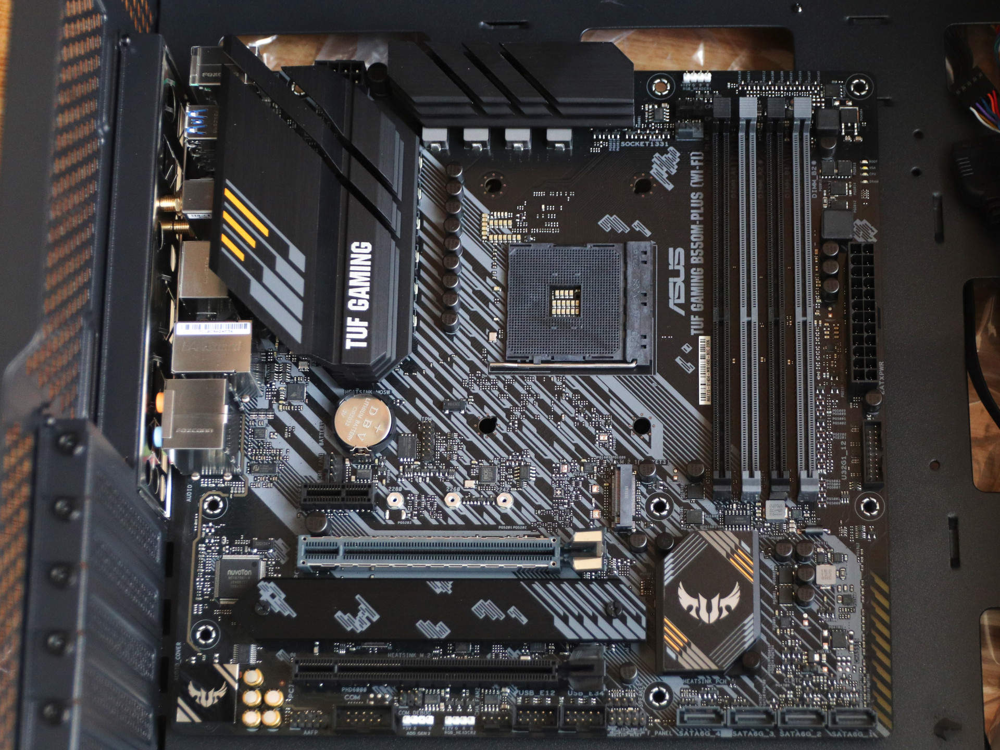

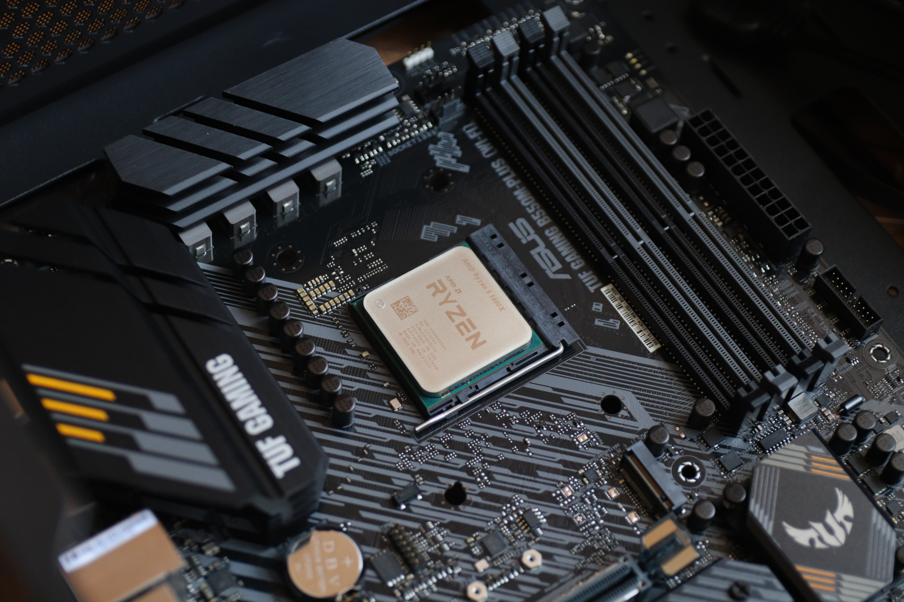

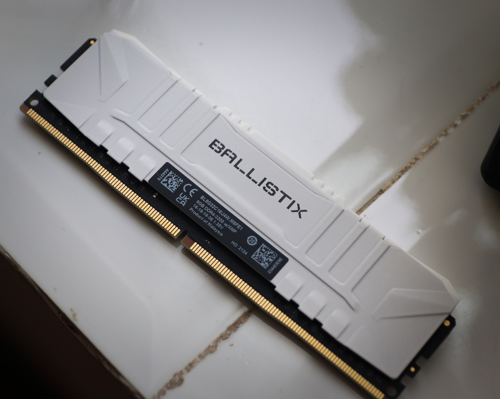

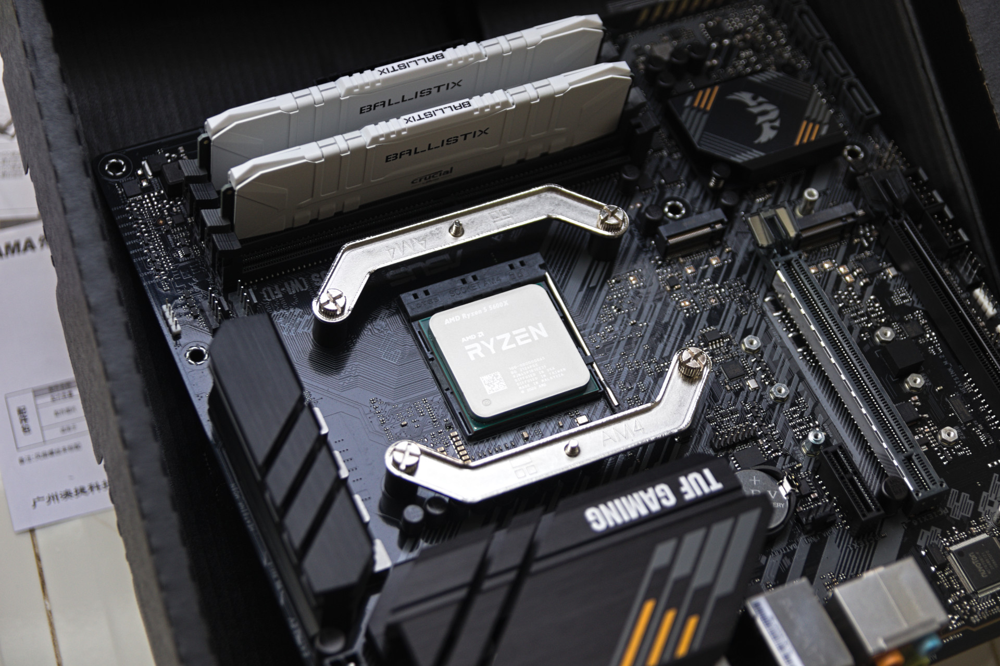

----

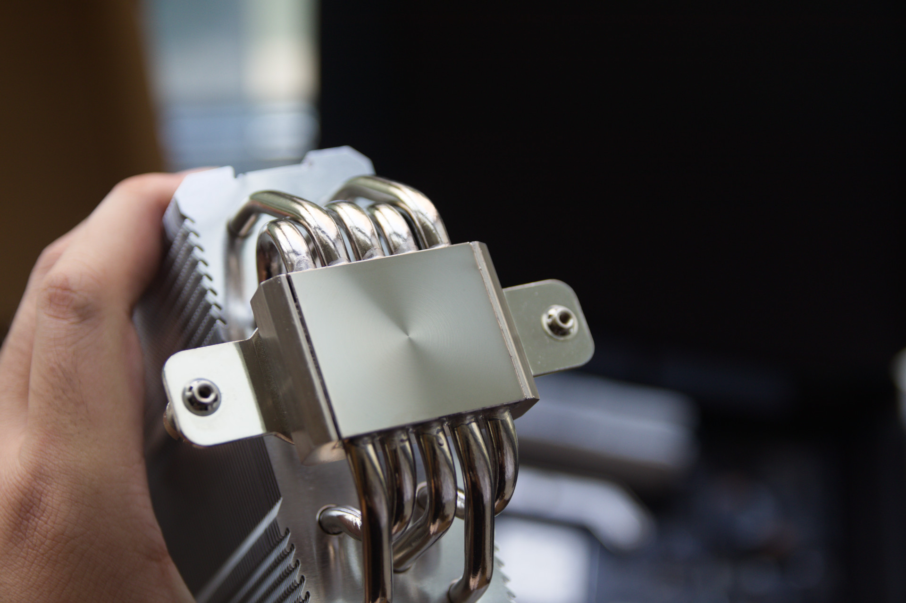

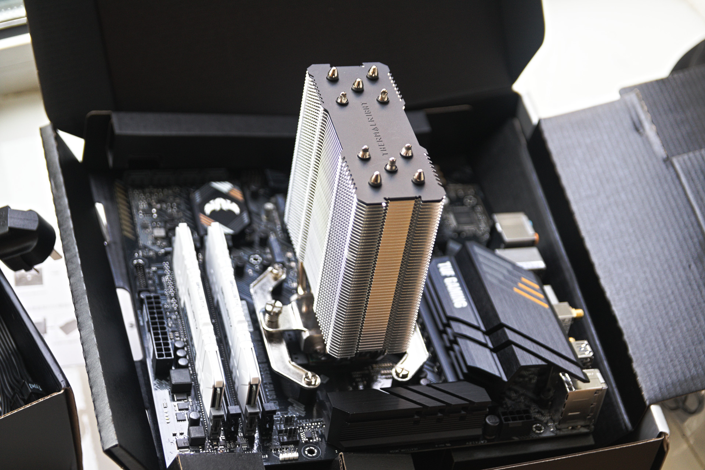

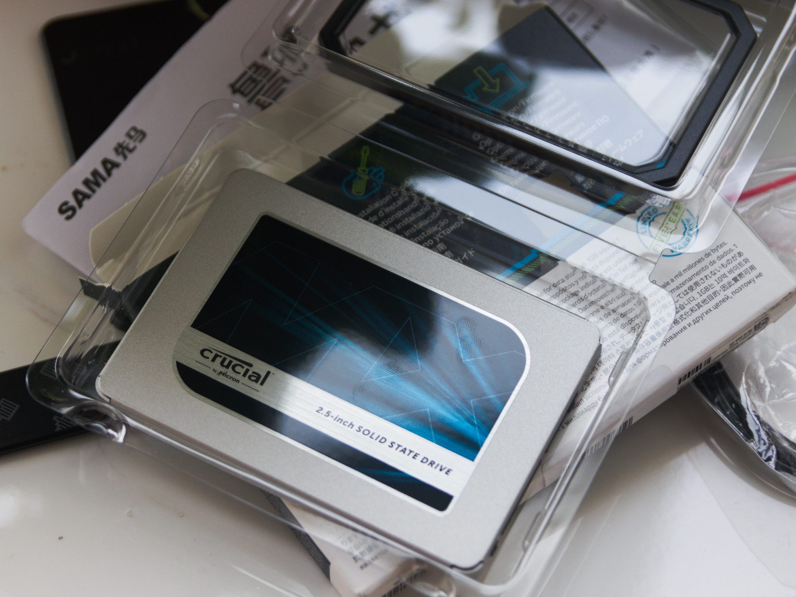

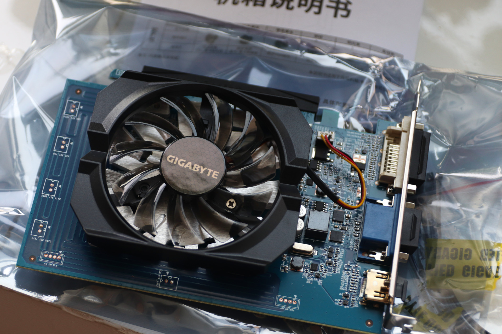

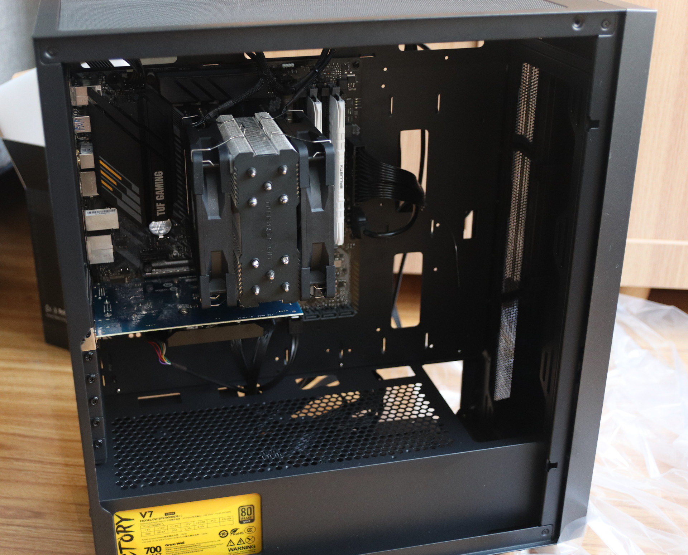

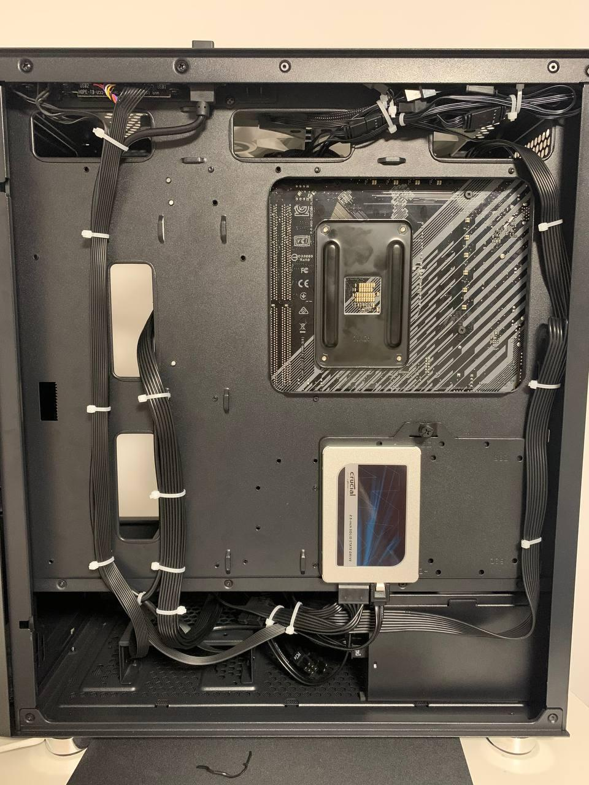
----

## 最终成果展示

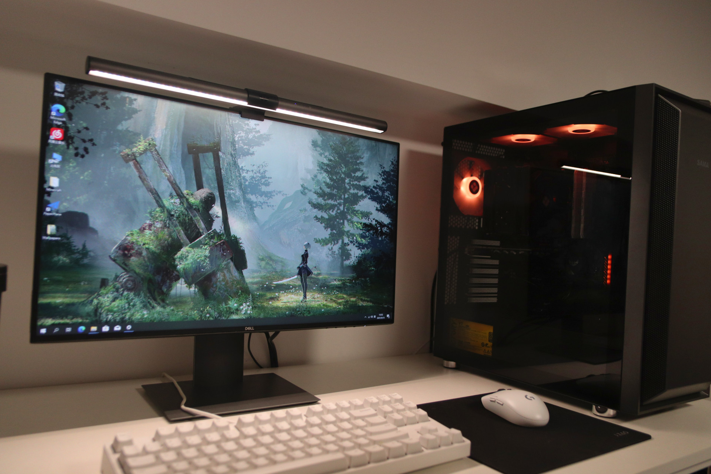

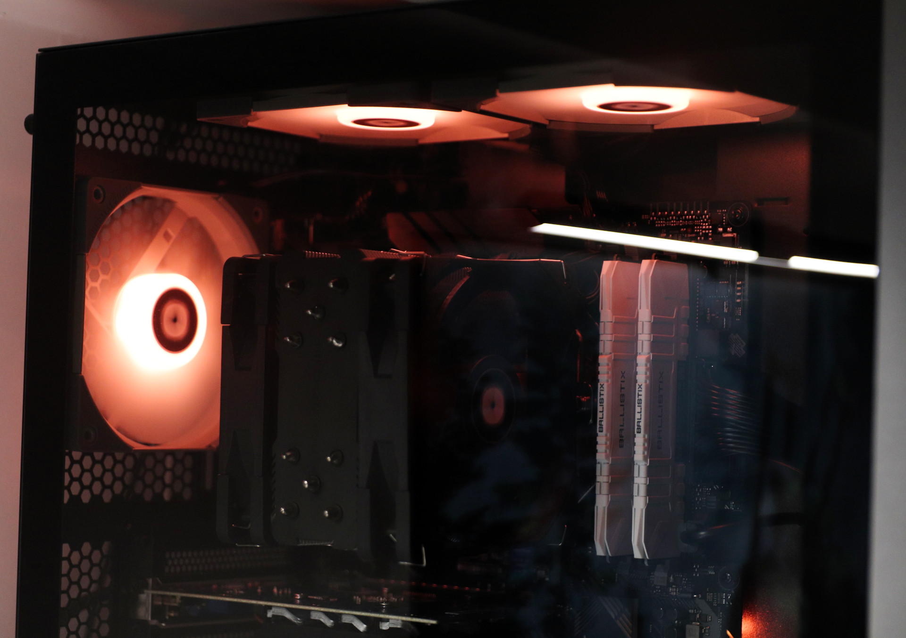

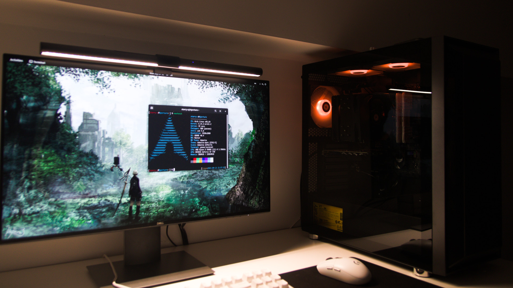

----

**by STARRY-S**
