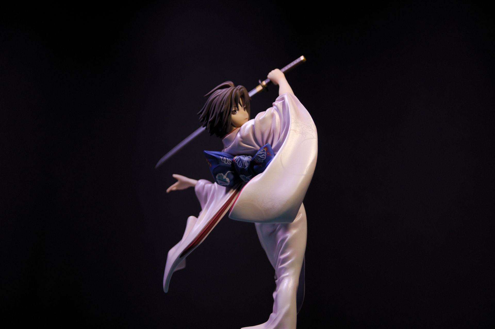
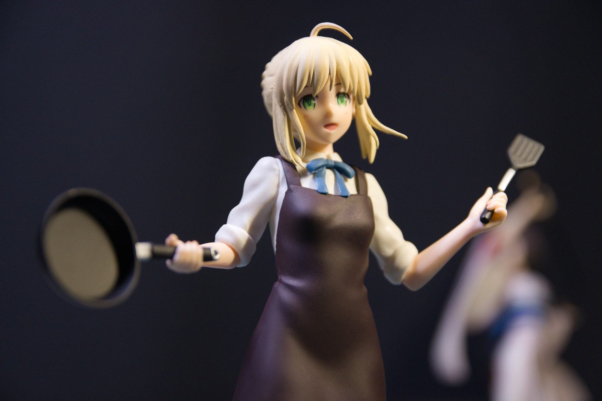

又到了写年终总结的时候了，说实话今年发生了好多好多好多的事情，我可能要写很久才能把这些事全写完。然而我文笔不好，回忆事情容易写成流水帐，所以不重要的事情我只好简短略过一下。

<!--more-->

<!--aplayer
{
    "name": "How to Love",
    "artist": "A-One",
    "theme": "#f11c62",
    "url": "https://music.starry-s.moe/music/070e_530e_020b_0dd79823b4ddc4a054895ae0101d5eae.m4a",
    "cover": "https://music.starry-s.moe/music/cover/7951668093293588.jpg"
}
-->

----

容我翻一下去年的Todo List……

今年在PS4上完成了三刷尼尔：机械纪元，全程没开简单模式和自动芯片，做完了大多数支线，然后除了DLC里的难度极高的斗兽场没有打，其他的DLC剧情全过了一遍，还看了几遍柏拉图的记忆。
顺便在B站会员购上买了两个尼尔的八音盒，曲子分别是*Kaine*和*Weight of the world*，尽管八音盒只能无限循环一小段，有种洗脑循环的感觉，但是偶尔听一下还是蛮好听的。
然后我应该是去年就把尼尔原著的短话就看完了，今年看的少年寄叶，不过只看了一半还没读完。长话因为和主线剧情一样所以我买来翻了几页就放起来了。
不得不说日本的游戏剧情支线真的特别多，全打完的话非常的肝，而且很费时间，不过发现了新的隐藏剧情还是很开心的。

然后咱还在PS4上斥巨资买了正版的尼尔：伪装者，也就是机械纪元的前作（钱包在滴血），打通了一周目和二周目，然后因为时间原因加上后面剧情都是重复的，就没玩下去。尼尔：伪装者的游戏内容比机械纪元要少很多，而且可玩性比机械纪元差很多（本来机械纪元的游戏体验就不怎么好），所以这也是我玩不下去的原因之一。

然后上半年的时候通关了传送门2单人模式，之前蛮期待的Nier:Reincarnation手游下载后看了几眼感觉不感兴趣没继续玩下去。然后月姬重置版只在日本发售，其他区服买不到，因为懒得换区加上不会日语，所以玩月姬的计划也被我抛在脑后。

不得不承认咱的大部分时间都拿去打守望先锋了，这游戏玩上就有种停不下来的感觉，所以在守望上花了好多时间，然后经常在竞技模式里被气得卸游戏，过两天又想玩然后把它下载回来……

其余时间还玩了一阵子Minecraft，完成了非常大的工程，在原点空置域修了全物品分类机，不过比较气愤的就是1.17新增了好多新的物品，我旧的全物品分类机装不下，然后1.18又在Y0至-64的高度区域生成新的洞穴，所以我之前的空置域又白炸了，所以我还在继续玩1.16.4，没有升级游戏版本。

这么一回忆起来，怎么有一种我这一年的时间全荒废在打游戏的错觉……

----

上面写的游戏经历只不过是一小部分而已，咱在今年买了Kindle PaperWhite4，看了《自控力》、《黑客与画家》这两本书，还二刷了《空之境界》原著，之后就是用Kindle看了一些技术类书的样章，不过在Kindle上有些书的代码是以图片的形式显示的，所以阅览效果并不好。

咱还买了好多纸质书，都是技术相关的，因为大多都只是简单翻了几页，所以就不列举名字了，今年要是有时间的话就试着看几本吧。

技术方面的话，咱今年靠着自己的努力尝试着写了一些程序，软件工程的大作业为了赶时间，用现学的前端知识和JS写了一个“能用”的问卷调查系统。不过后来我实在看不下去自己当时写的代码太不规范了，所以对代码进行了简单的整理和优化，顺便提高了一些安全性，不过和那些能稳定运行的大型软件相比肯定还是差远了。

然后就是自学了点现代OpenGL，选了学校的计算机图形学选修课，不过老师讲课时用的老版本的GLUT进行画图，然后别的学生基本上就是上网找代码抄一下就交作业了，他们有些人甚至连透视都不知道是什么。

所以我当时花了好多时间学OpenGL的矩阵运算和渲染方面的东西，这东西入门的门槛还真是挺高的。然后简单的了解了一下核心模式写Shader之类的操作，不过时间比较紧碰撞检测那些东西我就没学，所以最后给老师交作业时写了个比较简陋的世界模型，里面放了一个大正方形当作地面，然后渲染了几个正方体当作物体，贴了我的世界的材质…… 没弄碰撞检测和物理引擎之类的东西，用纯C语言写真的太难了。

除此之外，咱学了一点GTK和Qt，用Qt写了软件工程结对编程的作业，然后用GTK写了个很简易的将多条视频合并成一个视频的小程序，挺多部分都是一边抄别人的代码一边学怎么写的，因为自己能力并不强，写的东西也都是勉强能用的程度，然后现在一回忆发现好多东西又都忘掉了。

----

大三下半年我花了好多时间在网上找实习工作，然后因为我几乎没有准备就去面试，所以被问到算法题或者一些需要靠刷题和背书才能学会的知识时我几乎全答不上来，所以我挂了好多面试。

额……因为我在此之前对秋招和春招之类的没有啥概念，我也没有找学长问这些经验，只靠着自己听老师和别的同学随口说的内容，现在回想起来当时自己纯粹是什么都不懂的状态在瞎找工作，也几乎没怎么考虑待遇和工作内容这类的十分现实的问题，在所有面试全都是被刷的情况下我去了最后一个同意我去实习的公司。

我还记得我第一次面试时紧张得不得了，然后因为什么都没准备所以面试官问我所有的东西都答不上来，面试结束后就觉得我这种表现对面试官很不尊重。

有个公司的HR在面试时问我有没有投其他公司的简历，我当时说谎告诉他没有，不过我猜他看出来了，后来还反复问我好多遍有没有投其他公司的简历，说实话我只是不想把这么惨痛的面试被刷经历说出来所以当时很紧张的和他说了谎，现在想想还是蛮内疚的，我几乎搞砸了每场面试，还给好多面试官留下了很不好的印象，社交废物可能就是我这种人吧。

所以别问我实习和找工作相关的东西，我没办法给你任何有价值的参考意见，你看我这么胡扯的做法就能体现出来。

所以要说结果的话，我在实习的时候放弃了继续工作的打算，开始向更多的实际问题思考，国庆假期回到家后，在研究生考试报名截止前两天报了本校的研究生考试，在距离考试不到两个月的时候辞职，12月初回学校，预习考试内容。

很明显，我写这些东西的时候，已经考完了今年的研究生考试，结果可显而知，我得二战了。

（亏我还能如此淡定的说出这些离大谱的东西）

让我以一名阅读这些文字的访客的角度思考一下…… 好了别骂了别骂了，再骂孩子就吓得以后啥都不敢干了，我做了好多的心理准备才敢把这些事情写出来，要是有人骂的话我肯定忍不住要删掉的，毕竟万事开头难，咱已经吃过好多苦头了。

我这只不过是一个什么都不懂的学生想凭借他的努力找到第一个实习工作的比较客观的真实反映而已，你看B乎上那些新编的故事有时候不能反映自己真实的情况，我承认我有些方法确实做得不够成熟……

不过，这次实习我还是有很丰富的收获的，很幸运，我实习的公司对我很好，尽管任务量比较大，让实习生直接进行生产项目的开发，直接解决客户提的问题，但这些都还在能接受的范围内。
可能是因为咱刚接触这些领域吧，对这些还有一些新鲜感。

我用实习的工资组装了一个台式机，就是之前博客里面写的那台电脑，当初从北京回家时因为快递拒收电脑，所以我扛着装电脑机箱和显示器的箱子坐高铁回家，别提有多狼狈了。

在北京的这三个月的生活我可以用惨来形容，不用多说，你看我上面写的这些就能想到为什么惨了。

只不过我没有在之前的几篇博客中提到这些事情而已，因为咱不想把技术类文章和这些琐事混到一起，说出来又解决不了什么实际问题。

----

一提到实习这段经历就不由自主的把气氛搞沉重了，通过三个月的实习对北京这个城市有了一个新的认识，不过从自己眼中看到的事物并非是全面的，毕竟北京城太大了。

要说离谱的话，可能就是我从实习结束到回学校考研这段经历比较离谱吧，两个月的时间就算英语和政治能勉强速成一下，专业课几乎裸考，但是数学是真没复习完，更何况今年题变难了许多。

换个话题吧，今年抽时间看了狼与香辛料，然后因为实在等不起国内的引进所以在网上找了资源看了FSN HF3。
Fate的HF线细节很多，音乐也很好听，剧情的节奏把握得也很不错，身为月厨的我看得十分满意。

咱暑假的时候在B站会员购上预购了世嘉的卫宫家今天的饭的呆毛的手办，之后斥巨资预购了寿屋的两仪式再版手办。

说实话真没想到能在2021年买到再版的空之境界的手办。

11月底的时候付的尾款，组装后拍了几张照片。

----

以后不打算把太多时间花在游戏上了，至少我不想再像以前那样玩守望先锋了，其他比较缓和的游戏还是可以玩的。
之前在我的腾讯云学生版云主机上搭了一个小型的Minecraft服务器，主要是想和我的同学一起联机生存，年底进服务器发现他们盖了好多建筑，肥肠开心。

其他游戏是真玩不下去了，以后还是得注重身体，从疫情开始到现在体重飙升至200斤了，最近经常熬夜搞得身体很不好，所以以后还是得注重身体。

2022年咱可能要面临更多的问题，我暂时还有些不敢去想。还有半年就要大学毕业，然后还有好多我从来没经历过的事情需要去面对。

所以还是尽可能的保持乐观吧，悲观解决不了任何实际问题。

就写这么多吧，要是以后还想到了哪些东西再来补充。

**STARRY-S**
